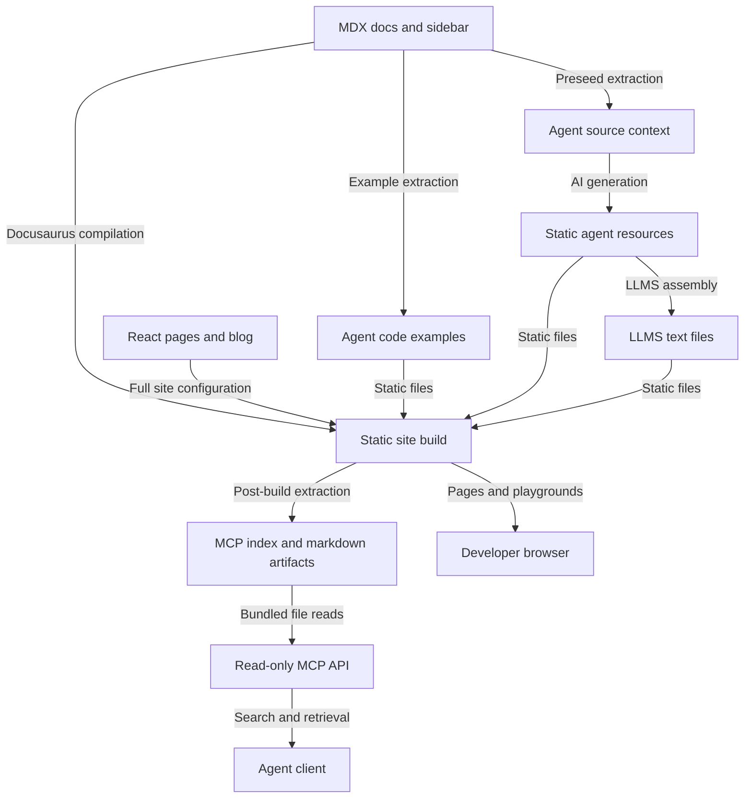
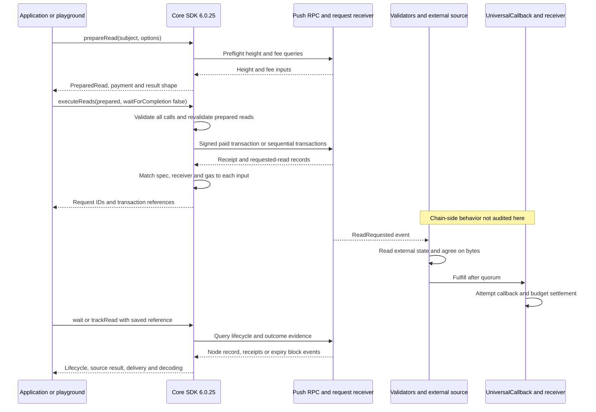
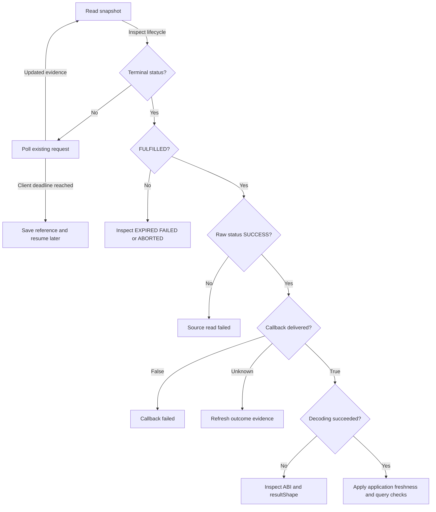

# Push website and Universal Read architecture

Checked: 2026-09-21. Source revision: `1b787bbf61cbd5c3b38402e1e2784c5a95ad04b1`.
The working tree was clean before this documentation pass. This map and its README pointer are the only changes made by the review.

## Scope and evidence

This repository publishes the website, developer documentation, browser playgrounds, agent resources and a read-only documentation MCP endpoint. It consumes Universal Read through the installed `@pushchain/core@6.0.25`; it does not implement validator consensus or the receiver contracts.

The website/build relationships below are implementation-backed. The SDK flow was checked against the installed package. Validator and contract behavior is documented integration behavior, not independently verified node/contract implementation or live execution. Landing-page internals, translation correctness and the full SDK are outside this review.

Implementation takes precedence over tests, then explanatory documentation. Live receipts are required to establish deployed behavior. An installed SDK or a documentation claim does not establish a successful on-chain read.

## How does source content reach people and agents?

The MCP mirror derives from the main Docusaurus config but excludes pages, blogs and analytics. The MCP API retrieves prebuilt documentation; it does not execute Universal Read or manage wallets. Agent resource generation is a separate command family and is not equivalent to MCP artifact generation.

| Relationship | Source and symbols |
| --- | --- |
| Site routes, MDX and Mermaid support | [docusaurus.config.js](docusaurus.config.js), [sidebars.js](sidebars.js) |
| Read guide and executable snippets | [13a-Universal-Read.mdx](docs/chain/03-build/13a-Universal-Read.mdx) |
| Browser execution and SDK injection | [NodeJSVirtualIDE.tsx](src/components/NodeJSVirtualIDE/NodeJSVirtualIDE.tsx), `returnPlaygroundCode`; [ReactLiveScope](src/theme/ReactLiveScope/index.js), `loadClientSideLibraryPushChainCore` |
| Agent generation | [build.agents.preseed.mjs](build.agents.preseed.mjs), [build.agents.mjs](build.agents.mjs), `writeAgentFiles`; [build.agents.examples.mjs](build.agents.examples.mjs); [build.agents.llms.mjs](build.agents.llms.mjs) |
| MCP artifact production | [plugin.ts](mcp/src/build/plugin.ts), `postBuild`; [artifacts.ts](mcp/src/build/artifacts.ts), `buildMcpArtifacts` |
| MCP serving boundary | [api/index.ts](api/index.ts), [store.ts](mcp/src/runtime/store.ts), [tools/index.ts](mcp/src/runtime/tools/index.ts), `REGISTERED_TOOLS` |
| Deployment configuration | [docusaurus.config.mcp.js](docusaurus.config.mcp.js), [vercel.json](vercel.json), [package.json](package.json) |

## What happens when a developer requests external state?

`read()` composes preparation and execution for one request. `prepareRead()` and `trackRead()` do not broadcast. Submission may be atomic or sequential; fulfillment remains independent for each request. On sequential failure, committed and uncertain transaction hashes must be inspected before retrying.

Use direct RPC reads when only a frontend/backend needs the data. Universal Read adds a paid request and on-chain delivery. The default shared registry removes the requirement to deploy a receiver. Custom receivers need an authenticated callback and a payable request entrypoint authorized for the actual Push-side sender, including its UEA when applicable.

| SDK responsibility | Installed-package evidence (dependency, not owned source) |
| --- | --- |
| Public orchestration and default refund account | `node_modules/@pushchain/core/src/lib/orchestrator/internals/read-state.js` |
| Query, callback and lifecycle options | `node_modules/@pushchain/core/src/lib/read-state/read-params.js` and `.d.ts` |
| Payment and spec preparation | `node_modules/@pushchain/core/src/lib/read-state/spec-builder.js`, `budget.js`, `preflight.js` |
| Receipt matching and batch recovery | `node_modules/@pushchain/core/src/lib/read-state/read-executor.js`, `executeReads` |
| Lifecycle and evidence reconstruction | `node_modules/@pushchain/core/src/lib/read-state/read-tracker.js`, `trackRead`, `waitForRead`, `collectOutcome`, `collectExpiryOutcome` |
| Public integration instructions | [Universal Read workflow](static/agents/workflows/universal-read.md), [contract helpers](docs/chain/03-build/08-Contract-Helpers.mdx) |

## When is a result usable?

This is a client decision flow, not a claim about every legal node state transition. Timeout does not cancel the request. A terminal snapshot can lack callback or refund evidence when receipt lookups fail; unknown is not false or zero. The installed `waitForRead` can return a terminal snapshot immediately, so use `refresh()` to explicitly retry missing evidence. A successful decode also does not prove that the value is fresh enough for an application's business decision.

## Review findings and recommended work

1. **Playground completion is not awaited.** The guide calls `main().catch(...)` without returning/awaiting it. `NodeJSVirtualIDE` awaits its generated wrapper, which finishes before `main()` does and resets `isRunning`. The offline checker replaces that ending with `await main()`, so it does not exercise this browser behavior. Await snippet completion in the runner contract and verify Run remains disabled through prompts, submission and tracking; duplicate execution can create another paid read.
2. **The new check is not a CI gate.** `check:universal-read` exists, but the preview workflow invokes only the preview build. Add offline read validation and agent-link checking to PR CI. The SDK repository's own CI was not audited here.
3. **Contract coverage is structural only.** The checker syntax-checks three JavaScript examples, compares selected SDK constants/addresses, and regex-checks the receiver. It does not compile Solidity or typecheck the TypeScript API examples. Add a pinned-contract compile check, type assertions for invalid query/callback combinations, and failure-path tests for callback revert, expiry, partial batch submission and resumed decoding.
4. **Agent regeneration needs stronger protection.** `build.agents.mjs` writes model-produced paths/content directly, checks missing expected outputs after writing, and logs per-phase failures without making the completed run fail. Its explicit workflow list omits Universal Read. Stage outputs, enforce path/schema/required-capability checks, and fail on partial generation before replacing canonical files. Add a deterministic Universal Read drift check across generated resources.
5. **Document evidence recovery.** Distinguish a failed callback from missing receipt evidence; demonstrate `refresh()` and per-read batch outcomes rather than throwing at the first unusable result.

## Verification, operations and maintenance

Checks run for this review:

- `node scripts/check-universal-read-examples.mjs`: passed three playground syntax checks plus the script's structural and SDK parity assertions.
- `node scripts/check-agent-links.mjs --no-http`: passed 146 local link targets; skipped 534 HTTP targets. This does not validate remote URLs or anchors.
- All three Mermaid diagrams parsed and rendered locally with Mermaid 11.15.0 and were visually inspected. All Markdown source-link targets exist.

Not run: funded live reads, contract compilation, full production build or node consensus tests. No deployment claim is made. The guide's `--live` checker funds temporary testnet wallets and submits transactions; it is not an offline test.

Documented defaults, not measured performance: 2-second polling (500 ms minimum), 300 Push-block expiry, 500,000 registry callback gas, 1,000,000 maximum callback gas. Default wait uses remaining Push lifetime at 1,340 ms/block plus 10 seconds, capped at 180 seconds. HTTP timeout, chain expiry and client timeout are separate clocks.

Recommended operational metrics: request-to-fulfillment latency, expiry rate, callback failure rate, missing-evidence rate, refunds rejected, decoding errors and partial batch submissions. The reviewed code does not establish production alerting or SLOs for these metrics.

Migration/rollback: this review changes documentation only. Future SDK upgrades should revalidate snippets, constants, receivers and agent resources together. Reverting website files does not revert deployed contracts or cancel outstanding requests; retain request references and compatible decoding information.

Refresh this map when routes, generator inputs, MCP artifact contracts or read lifecycle behavior change. Compare the checked revision and installed SDK version with current sources. No automated semantic drift gate or custom viewer integration was installed by this review.
