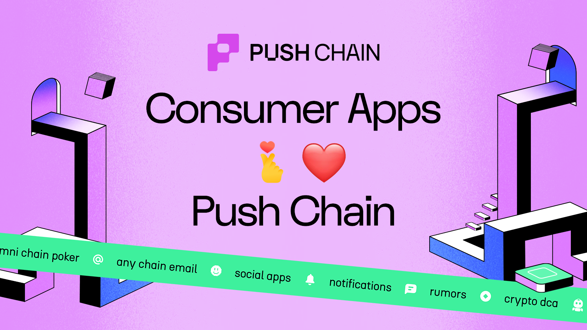

<!--truncate-->

Web 3 is growing at lightning speed!

Hundreds of L1s, Thousands of L2s and soon Tens of thousands of L3s!!

While striving to make systems more scalable, decentralized and secure, we risk overlooking a crucial goal - **To expand the boundaries of web3 for all users.**

And with increasing fragmentation coupled with complex pre-requisites to interact on-chain, inflexible infrastructure for consumer apps, and a lack of chain unification, the barrier to entry is rising, leading to the emergence of more closed and isolated systems.

But not anymore.

**Introducing Push Chain - A shared state blockchain for shared app experiences!**

## What is Push Chain?

Push Chain is a Proof of Stake shared state blockchain designed to support the development of hyper-scalable, consumer-centric, universal web3 applications by unifying settlement from any L1s, L2s and L3s.

### Push Chain Superpowers Include:

- **Any Chain Tx (Solana, Eth, EVM, or non-EVM)**⛓️ :
  - Enables cross-chain transactions from EVM, Solana or any nonEVM by accepting signed payloads verified by Push validator nodes.
- **Sub-second finality ⚡⏱️ :**
  - With CometBFT Consensus.
- **True Universal Chain 🚀 :**
  - Natively recognizes and attributes transactions to the right wallet and the source chain.
- **Universal Fee Abstraction**💰 :
  - Non-push chain wallets can seamlessly pay fees through native token swaps, delegation, web3 applications, or the traditional wallet-pays-fees model.
- **Wallet Abstraction** 🔐 :
  - Simplify blockchain access by offering social logins, phone or email authentication, and secure recovery.
- **Consumer tx (unordered) and Traditional tx (ordered)** 🛍️:
  - Introduces _'consumer transactions'_ for unordered, high-speed scalability, leveraging parallel execution, and dynamic sharding.
- **Universal Smart Contract** 🌐 :
  - Smart contracts that can read the state of EVM or non-EVM wallets of other chains in the future, enabling developers to create a seamless universal app.
- **Shared App Experience** 🤝 :
  - App is truly shared by all users of all chains

**Push Chain is purpose-built to power onchain AI**, leveraging shared state, fast finality, dynamic sharding, and cross-chain compatibility. It supports scalable, versatile AI use cases and seamless consumer experiences, enabling AI agents, marketplaces and more, _check examples below._

**We are building Push Chain with the vision of enabling users, irrespective of what blockchain they are on to seamlessly connect with web3 applications across any blockchain.**

## Push Chain gives you a Billion Reasons to Build!

Push Chain is your go-to chain for building universal mixed apps!

Here’s a brief glimpse of the future of web3 and the countless innovations that you can make happen because of Push Chain.

### Universal DeFi

Push Chain can unleash DeFi 3.0 by finally supporting **financial applications** with universal capabilities:

- **Unified DEXes: Enable smooth exchanges and transfers across chains.** tokens and stablecoins from any chain can be utilized to create a seamless decentralized exchange (DEX)
- **Unified Lending - Borrow Apps**. Users from any chain can lend and borrow, addressing fragmented liquidity and enabling applications that act as universal liquidity hubs—taking liquidity from one chain and providing it to another.
- **Global Payment Systems**: Build payment gateways where users can transact with minimal fees using tokens from any blockchain

---

### Universal AI Apps

Build on-chain Ai agents and platforms that are not bound to any single-chain and operate across chains autonomously using Push Chain’s shared state and Universal Smart Contract capabilies.

Examples include:

**→ Unified Data Layers for AI Agents:**

- Ai agents often need to access, analyze, and react to a large variety of onchain and offchain data.
- Using Push Chain's unified user identity (**Push ID**), AI agents can retrieve a user's aggregated state from multiple chains—assets, past activities, communication history, and more.

**→ Chain Agnostic Autonomous Actions:**

- Using interoperability and knowledge of multiple user wallets across chains, an AI agent could rebalance a user's DeFi positions on Ethereum, list NFTs on Polygon, and communicate status updates to the user via a messaging app on another chain, all through one unified settlement layer.

**→ Universal AI Launchpads** 🚀

- One unified platform to launch agents across any chain
- Universal payment acceptance (any token from any chain)
- Can be scaled to support thousands of concurrent agent operations

---

### Universal Token Launchpads

- One unified platform to launch tokens across any chain
- Universal payment acceptance (any token from any chain)

---

### Universal Prediction Markets ⚖️

Prediction markets like [Polymarket](https://polymarket.com) (native to Polygon only)- have already achieved mainstream PMF. Take it a step further and build cross-chain Prediction markets where:

- Markets aggregate liquidity from all chains simultaneously
- Users participate from any wallet (ETH, SOL, etc.) without manually bridging!
- Fee abstraction allows platforms to cover gas costs for users.

---

### Universal Governance

- Build cross-chain governance systems that allow users to vote on proposals from any chain.
- Solves voters apathy by making voting more accessible and engaging.

---

### Universal Social Apps

Push Chain’s scalability as well as fee and wallet abstraction make it ideal for building decentralized social platforms.

- **Unifies all on-chain users** (quite literally) spread across all chains into one shared layer.
- **Leverage Push Chain’s sub second finality** to build next-generation social apps such as social investing platforms (e.g., GoFundMe or grants), decentralized alternatives to Reddit, Telegram, or TikTok, and other social networks.
- **Enable** **Core social app features** - replies, likes, and user connections using unordered transactions (consumer transactions).
- **Using PushID** - A Polygon wallet can communicate and interact with a Solana Wallet, all under one shared state!
- Enable Login with any wallet or Web2 credentials (session keys)
- **Social Rewards Apps**: Create apps where users earn rewards for engagement, such as likes, shares, or creating valuable content.

---

### Universal Gaming

Push Chain lets gaming and degen apps break free from single-chain silos.

- Build cross chain games with Push Chain to bring players from different chains together for unified tournaments or gaming sessions.
- Examples include poker platforms, slot games, sports betting, fantasy sports, shared lottery systems like PoolTogether, trading card platforms, and gacha games.

---

### Cross-Chain Analytics and Portfolio Management

Leveraging Push Chain’s interoperability and shared state build powerful **analytics and management tools**:

- **Web3 Portfolios**. By mapping wallets through Push ID and leveraging seamless interoperability, web3 portfolios can track balances, NFT collections, and DeFi positions and assets across multiple chains, providing users with a unified view of their holdings.
- **Analytics and Recommendations**: Build analytics platforms that provide insights into user’s on-chain user behaviour, enabling personalized recommendations or investment advice.
- **Cross-Chain Governance Dashboards**: Aggregate DAO governance activities across chains, providing users with a unified voting and proposal management system.
- **Universal Web3 Analytics and Recommendation.** Enable analytics to track user activity and capabilities, unlocking recommendation engines, AI based decision engines, targeted promotions, and other innovative features

### Utility and Productivity Applications

Build **utility applications with Push Chain** that simplify and enhance everyday tasks:

- **Decentralized Email and Messaging**: Build secure, blockchain-based email services where users communicate using their wallet addresses or Push IDs.
- **Web3 Blogging and Content Platforms**: Create decentralized blogging platforms where users can publish, share, and monetize content without relying on centralized hosts.
- **Data Storage and Retrieval**: Build applications for storing user settings, metadata, or application states, enabling decentralized profiles and preferences.
- **Utility Apps with Universal Reach.** These applications thrive on combining user bases from all blockchains. Examples include email services, notifications and chat platforms, blogging tools, decentralized wikis, and internet archives. These apps benefit from a unified web3 user base, making Push Chain the perfect environment for their growth.

---

### Education and Training Platforms

Push Chain supports **decentralized education platforms** that enhance learning experiences.

- **Credential Management**: Verify and share academic achievements securely on the blockchain.
- **Incentivized Learning Platforms**: Reward users with tokens for completing courses or achieving milestones.
- **Decentralized Knowledge Sharing**: Develop platforms where users can share and monetize expertise in a peer-to-peer manner.

---

These ideas are just the tip of the iceberg - we're merely scratching the surface!
Push Chain gives you a **Billion Reasons to Build** Any App _for_ Any User _on_ Any Chain.

Already have an idea to build? Want guidance to make it happen?

Reach out to us on our [Push Discord Community](https://discord.com/invite/pushprotocol).
