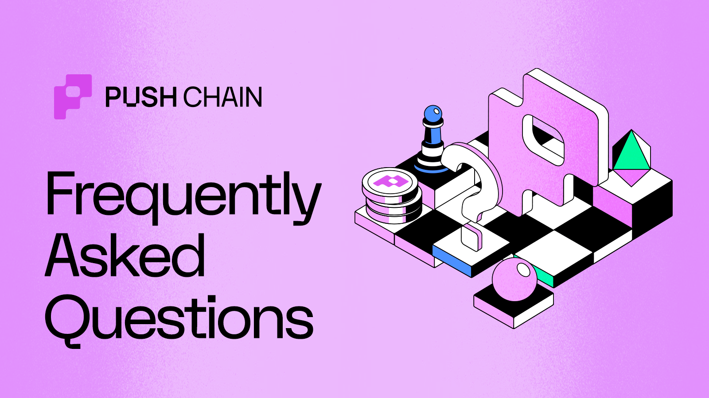

<!--truncate-->

:::warning

This article is outdated and deprecated. Please refer to the [Push Chain's Knowledge Base FAQ](/knowledge/faq) for latest information.

:::

## Frequently Asked Questions

The place to find answers to all the popular questions the community has asked about Push Chain. Crowdsourced from Push Fam 🫶 and curated by the Push team 💪.

## Overview

---

### What is Push Chain?

Push Chain is a shared-state Layer 1 blockchain built to eliminate fragmentation across all chains.

By enabling **seamless transactions from any chain** (Ethereum, Solana, EVM or non-EVM), it lets any user interact with web3 apps without juggling multiple wallets, tokens or gas mechanics.

In short, Push Chain unites L1s 🤝 L2s 🤝 L3s under one cohesive layer.

---

### How does Push Chain work?

Push Chain takes a unique approach to solving the problem of fragmentation across all chains. Instead of creating interop protocol which comes with complexities for both users and developers, it takes a novel approach by building a true universal blockchain that can be natively used by any user from any chain.

To achieve this, Push Chain leverages several **precompiles** which are custom modules created to:

1. **Recognize** users of other chains - Universal address standard that extends the address of a user to be blockchain agnostic (based on [CAIP-10 standards](https://github.com/ChainAgnostic/CAIPs/blob/main/CAIPs/caip-10.md)).

2. **Map** users to Push Chain - This is done by deploying a smart account called UEA (Universal Executor Account) for each user of a different chain. This module is used to deploy a smart account that then uses other precompiles to process the transactions.

3. **Execute** universal transactions - This is done by using USV (Universal Signature Verification) and UTXV (Universal Transaction Verifier) precompiles to verify and execute signatures and transactions from other chains.

4. **Abstract** away the complexities of the chain they are on - This is done by having universal gateway contracts on each chain that locks gas funds in native token of the chain (or any other compliant token) and then uses the UTXV precompiles to attribute the gas to UEA (Executor Account) and USV to execute the transaction.

This is an **extremely powerful approach** that allows users to interact with any app on Push Chain without worrying about the chain they are on or what wallet they are using as everything is abstracted away, for both the users and the developers.

---

### Why is Push Chain unique for users?

Push Chain addresses specific gaps in the existing blockchains, such as interoperability, state access across chains, programmable solvers and wallet abstraction resulting in a **full stack interop**. While existing blockchains are robust, they operate in their own eco-system and an aggregator to unite these chains are needed.

Push Chain’s focus is on being a **shared state chain** for universal (interoperable) applications acting as a unifying layer where all chains can come together and use PC as universal hub or do settlement between them.

It offers a new paradigm of web3 that works from **Any Chain.** For **Any Wallet / User.** And is suitable for **Any App.**

---

### What are the core innovations of Push Chain?

Push Chain is a Proof-of-Stake Layer 1 designed to eliminate fragmentation across every blockchain. Under the hood, it combines several key innovations:

- **True Universal Chain**  
  Natively supports all chains and enables users to interact with the same app. No centralized relayers, bridges, or other hacks needed.

- **Universal Fee & Wallet Abstraction**  
  Allows users to interact with the app from any chain without worrying about gas or wallet mechanics.

- **Single transaction for any chain**  
  Users only ever sign a single transaction, no matter from what chain they are interacting from.

- **Universal Smart Contracts**  
  100% EVM compatible smart contracts that can be deployed with **zero on-chain code changes**. Once deployed, they become instantly compatible with users of all chains.

- **Universal EVM**  
  Push Chain is smart enough to natively recognize users of other chains and correctly attributes and maps the transactions to them.

- **Shared State and Programmable Solvers**  
  (Roadmap) Enables smart contracts of Push Chain to read and write state to any other chain.

Together, these features let you build **universal web3 apps**. Instead of “Uniswap on Ethereum” or “Uniswap on Polygon,” a user simply becomes **user of Uniswap**—period.

---

### What problems does Push Chain solve?

- **Fragmentation**  
  Unites EVM & non-EVM chains under one shared-state L1, so users never need to hop networks or wallets.

- **Interoperability**  
  Native support for transactions from any blockchain and on-chain shared state.

- **Finality**  
  Instant, irreversible native finality in ~1–2 seconds—no more waiting or reorgs.

- **Onboarding & UX**  
  Social/email login, gas-in-any-token & any-wallet support for zero-friction access across chains.

- **Universal Apps**  
  Build once, deploy everywhere — any web3 app works seamlessly for any user on any chain.

---

### What are the apps that can be built on Push Chain?

Push Chain brings seamless interoperability and unifies all L1s 🤝 L2s 🤝 L3s. It is poised to become the playground of innovation and interop.

You can build and better existing web3 use cases such as:

- **Universal Dex** - Abstracted swap on any chain giving a CEX experience with chain security
- **Universal DeFi** - DeFi 3.0 can be unlocked that can become a universal bank across all chains.
- **Universal AI Agents** - Launch AI agents with universal payment support (any token, any chain)
- **Universal DAOs** - DAOs that are compatible with every chain and can be used to vote on proposals without blockchain silos
- **Universal Gaming** - Players of any chains can have unified tournaments or gaming session
- **Universal Marketplaces** - Marketplaces where players or NFTs of any chains can be traded
- **Universal Name Service** - Naming service that can resolve to multiple wallets

The apps and innovations that can happen on Push Chain are endless! Here are some [more use cases](/blog/consumer-apps-that-can-be-built-on-push-chain/) to get you started.

Builders can also check out the [Documentation Hub](/docs/) to get started.

---

## Technical

### Why does Push Chain need to be an L1 instead of an L2 chain?

Push Chain is built to serve as a **shared settlement layer** and **universal execution layer** for all other blockchains—roles that only a standalone L1 can fulfill:

- **Native Cross-Chain Settlement**  
  As an L1, Push Chain can directly finalize transactions from any chain without relying on a separate security or fraud-proof model.

- **Universal Execution & State Access**  
  Running its own consensus and state machine lets Push Chain interpret and execute transactions from Ethereum, Solana, and beyond—something an L2 (tied to a single base layer) cannot do natively.

- **No L2 Constraints or Delays**  
  L2s inherit the latency, finality rules, and gas model of their host chain (plus bridging overhead). Push Chain avoids those bottlenecks by offering instant finality and fee abstraction on its own.

- **True Shared State**  
  To read & write the state of multiple chains within smart contracts, you need direct, protocol-level access—only available at the L1 layer.

In short, only a purpose-built L1 can unify every chain under one cohesive execution and settlement layer without introducing extra complexity or trust assumptions.

---

### Is Push Chain EVM Compatible?

Absolutely! Push Chain is fully EVM compatible. You can deploy any EVM smart contract with **zero on-chain code changes**, and it will run seamlessly for users across all integrated chains (both EVM and non-EVM).

---

### Will Push Chain be compatible with both EVM and non-EVM chains?

Yes! Push Chain is built to bridge every blockchain paradigm.

- **EVM Compatibility**  
  Drop in your Solidity contracts and they run unchanged, leveraging Push Chain’s EVM runtime.

- **Non-EVM Support**  
  Native precompiles (USV/UTXV) and the universal address standard let Push Chain validate and execute transactions from Solana, Bitcoin, Cosmos SDK chains, and more.

In practice, users and apps from any chain can interact with Push Chain apps seamlessly — no matter the underlying VM.

---

### Why create a new blockchain when existing ones like Ethereum and Solana already exist?

Push Chain fills critical gaps that today’s blockchains, despite being robust, don’t address:

- **Interoperability**  
  Existing networks operate in silos, making cross-chain data and asset transfers cumbersome.

- **Zero-Friction UX**  
  Forget switching wallets or buying chain-specific gas. Social/email login + pay-with-any-token means users jump straight into apps without any onboarding hurdles.

- **Shared App Experience**  
  With every user on the same Push Chain, your app feels like one cohesive product, not a patchwork of “Uniswap on X” or “Uniswap on Y”.

- **Universal Execution Layer**  
  No single chain today can natively run transactions and smart contracts that support users from any chain.

Push Chain is designed as a **shared-state L1 for universal applications**, unifying state and execution across EVM and non-EVM ecosystems. **The result?** Seamless cross-chain interactions and truly universal apps that any user on any chain can access without friction.

---

### What does shared state blockchain mean?

Shared state refers to the present status of onchain data. A shared-state blockchain is one that has read-and-write access to its own state and the state of all other chains it interacts with.

A shared state chain is capable of handling data, liquidity, and users from any other chain.

---

### How does Push Chain achieve shared state?

A traditional blockchain only knows its own ledger and wallet standard. Push Chain extends that model in four key ways:

1. **Universal Wallet Compatibility**

- Supports chain agnostic addresses from any chain (Ethereum, Solana, Bitcoin, Cosmos SDK, etc.)
- Signatures from any chain are verified via USV/UTXV precompiles, so users never switch wallets.

2. **Universal Smart Contracts**

- EVM contracts deploy unchanged but can natively verify and execute cross-chain transactions.
- Push Chain’s runtime handles signature mapping and payload parsing for every supported network.

3. **On-Chain Shared State**

- Validators commit Merkle proofs of external chain state (via MPT roots) each block.
- Relayers fetch and submit leaf proofs on demand, so contracts can read any chain’s data in real time.

4. **Programmable Solvers**

- A solver network executes atomic cross-chain workflows (e.g., swap on Chain A, mint on Chain B) under a single transaction.
- Developers write simple solver scripts; the network handles routing and execution.

Together, these features turn Push Chain into a **shared-state L1** that enables universal apps to be native to all chains. A world where any user of any chain is able to access and interact with any app on any other chain.

**Any Chain, Any App, Any User - One Push Chain**

---

### What sets Push Chain apart from other Universal Chains?

Today’s so-called “universal” solutions still rely on bridges, wants double transactions or centralized relayers to move data and value. Push Chain is different—it’s the first **true** universal L1 that:

- **Unifies users across chains**  
  Every blockchain address is natively supported. Wallets like MetaMask, Phantom, etc are all compatible with Push Chain. Gas is paid in any token on any chain.

- **Acts as a universal execution layer**  
  All transactions finalize on the same chain, ensuring everyone interacts with the same app—no hacks, no workarounds.

- **Correctly attributes & executes any chain’s transactions**  
  Transactions are signed, verified and attributed to the wallet on the source chain. A True universal chain supports all!

- **Single Transaction for any chain**  
  Users sign just one transaction, regardless of their source chain.

- **Requires just one deployment**  
  Deploy your EVM contract one time with no code changes and everything else just magically works.

Together, these innovations make Push Chain the only blockchain offering **true protocol-level interoperability**—no bridges, no relayers, no fragmentation. Just one universal chain for all.

---

### What does True Universal Chain mean?

A **true universal chain** is a blockchain that treats every other network as first class citizens—no bridges, no centralized relayers, and no compatibility hacks. It delivers:

1. **Native Multichain Identity**  
   Wallets from Ethereum, Solana, any EVM or non-EVM chains all sign, verify and execute natively on Push Chain. So users never switch accounts or are troubled by the complexities of multiple wallets.

2. **Unified Settlement**  
   Transactions from any network finalize on Push Chain, giving everyone a single source of truth and enabling same app to be accessible by users of all chains.

3. **Single Transaction and Universal Fee Abstraction**  
   Users sign just one transaction, regardless of their source chain and pay gas in any token. No more maintaining or swapping countless tokens to use an app.

4. **Deploy Once, Use Everywhere**  
   Developers write and deploy smart contracts once (EVM or otherwise) with **zero** extra code — one deployment covers all chains.

Push Chain is the first to bake these features directly into its consensus and runtime, truly eliminating fragmentation — no workarounds, no extra layers, just one universal chain for everyone.

---

## Token Related

### Will there be a new token associated with Push Chain?

As a new layer 1, Push Chain would have its own native token with tokenomics suited to the functioning, maintenance, and security of a blockchain.

For full details, see our [Tokenomics deep dive](/knowledge/tokenomics/) 👀.

---

## Doubts

### What Happens to Push Notification and Push Chat?

Push Chain is a natural evolution of Push Protocol's vision. Current services of Push Protocol remain a priority, ensuring they continue to improve while benefiting from the new infrastructure.

Today's push notification and chat protocols will benefit significantly from being built on top of Push Chain. A dedicated section of the team will focus on maintaining and enhancing these protocols, ensuring they remain the de-facto standard in their respective domains.

By aligning with Push Chain, notifications and chat sent through the protocols will be processed as transactions on the chain. This integration not only enables these protocols to accrue value but also marks the beginning of a new chapter in their evolution, further enhancing their utility and impact within the web3 ecosystem.

---

### Is this project a distraction from improving current services?

No, read ☝️ [above](#what-happens-to-push-notification-and-push-chat).

---

### Is Push Chain a shift away from Push Protocol's core focus on notifications and chat?

No. Push Chain builds upon Push Protocol’s established foundation. Push Chain represents the **next evolution** of Push Protocol, not a departure.

---

### How will the launch of Push Chain affect existing partnerships and integrations?

Push Chain complements existing partnerships by offering additional capabilities like cross-chain support, faster finality, and scalable solutions. It strengthens collaborations by enabling partners to build and scale universal applications.

---

### How will Push Chain maintain decentralization while scaling?

Our Devnet demonstrated how we’ll scale using dynamic sharding and parallel execution—boosting throughput without compromising decentralization.

On testnet, we focused on full stack interop with the chain running on [CometBFT](https://github.com/cometbft/cometbft), a battle-tested, Byzantine-fault-tolerant engine. The network achieved sub-second finality and has the ability to handle up to [20k transactions per minute](https://github.com/push-protocol/push-chain/blob/main/docs/testnet-performance.md).

That proof of concept is just the beginning. As we roll out further scaling optimizations in later phases, we’re confident Push Chain can meet the demands of universal applications—securely and without centralization.

---

### Are there any risks of centralization with Push Chain?

**No.** Push Chain’s architecture emphasizes decentralization.

Push Chain is fully decentralized and is designed to be robust and resilient. Anyone can run a node and participate in the network and is incentivized or penalized through PoS. To Summarize:

- Validators and other actors operate independently and are incentivized through PoS.
- Governance mechanisms ensure community involvement.
- Every ecosystem party is included in governance to some extent.

To learn more about how to run a node, see our [Knowledge Base](/knowledge/) or check out our [Validator Node Repo](https://github.com/pushchain/push-chain-node).

---

## DAO and Grants

### How will the current governance system change when the new token launches and when the migration is completed?

The Push DAO governance system will both evolve and expand as Push Chain launches. This is an expected process, since Push is becoming something more encompassing than the original Push Protocol. Delegates, ambassador programs, subDAOs, and everything else related to the DAO will be upgraded to reflect the key goals of achieving status as the hub for universal applications, run by all of the groups that make them possible.

### How do I get involved with Push Chain Grants?

Push Chain doesn’t have a grants program yet but that will change soon! Meanwhile, to frontrun other grantees, please drop us an email at <a href="mailto:team@push.org">team@push.org</a> with the subject line as **Grant MEOW** and your app idea. Or, simply follow [@PushChain](https://x.com/PushChain 'Follow Push Chain on X') for more updates around the grants program and its release.

We will go through the list in the order we get them and, as soon as grants are open for Push Chain.

---

## Developers, Users and Node Operators

### Are there incentives for early adopters or node operators on Push Chain?

Node operators will earn staking rewards once mainnet launches and are encouraged to take part in **Push Points Program** to earn rewards.

Early adopters are also encouraged to take part in points program to earn rewards. Start by visiting [Push Portal](https://portal.push.org/).

---

### What benefits does Push Chain offer to developers and users?

#### For Developers

- **Deploy Once, 10× Your Reach**  
  Deploy your App a single time — no code changes — and it runs on every supported chain, even non-EVM networks.

- **Audit-Friendly, 100% EVM Compatible**  
  Leverage existing Solidity contracts without extra audits or rewrites—focus your budget on features, not infrastructure.

- **Unified, Frictionless UX**  
  Users sign one transaction, pay in any token, and interact via any wallet — your app just works everywhere.

- **Lightning-Fast DX**  
  Spin up with our SDKs, virtual editors, and React playgrounds; go from zero to live in minutes.

#### For Users

- **One-Click Onboarding**  
  Login with email, social, or any existing wallet — no more seed phrases or chain-hopping.

- **Seamless Interactions**  
  Gas, wallet, and chain complexities are hidden — enjoy apps as if they were native to your network.

- **We're Fast**  
  Transactions finalize in 1-2 seconds, feels like native to the chain you are on.

---

### How can developers start building on Push Chain?

🚀 Visit our [Documentation Hub](/docs/) to get everything you need:

- 🖥️ **Virtual Code Editors**: Spin up SDK function calls in your browser
- ⚛️ **React Playground**: Prototype your frontend in real time
- 📚 **End-to-End Examples**: Follow complete project walkthroughs

You’ll have a sample app live in minutes—no local setup required!

---

### Where can I find more information and stay updated on Push Chain's progress?

The best way to stay on top of Push Chain’s progress is through the official Push channels: website, [Twitter/X](https://x.com/PushChain 'Push Protocol on X'), [Telegram](https://t.me/epnsproject 'Push Protocol on Telegram'), and [Discord](https://discord.gg/pushprotocol 'Push Protocol on Discord').

Always remain cautious of phishing links, websites or any scam links asking you for your crypto. All official communications will go out from our official Push handles.
