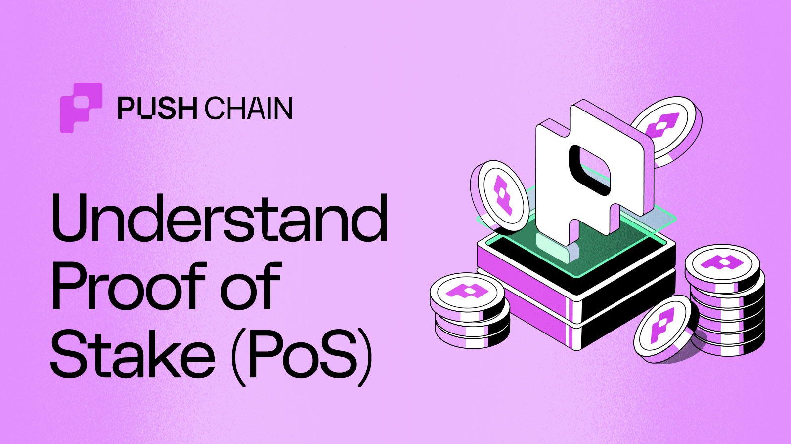

<!--truncate-->

## Introduction

In a globally distributed computing environment, achieving collective agreement on the true state of the system has always been a complex challenge.

Fortunately, there are algorithms (_specialized instructions_) that assist in preserving this ‘single-truth-state’ while balancing network security, long-term sustainability, and economic incentives.

Such algorithms in the web3 space, are popularly known as Consensus Algorithms.

This article is the only guide you will need to know about - What Proof of Stake is, its significance and how does it work.

## Proof of Stake - A Quick Overview

Proof of Stake is a consensus algorithm used to secure blockchain networks where block producers (validators) are chosen based on the number of tokens they're willing to "stake" or lock up as collateral.

Validators are incentivised to act honestly, since, any malicious behaviour would result in them losing their staked assets.

Validators are nodes responsible for securing the network by performing two key actions:

- Proposing new blocks - containing transactions.
- Attestation - Examining and voting on the blocks proposed by other validators

Now that we have a basic understanding about the PoS, lets go down the rabbit hole to know more about it.

## Why do we need PoS?

Each network is based on some foundational philosophies.

Bitcoin popularly known for its PoW (Proof of Work) algorithm is based on the principal of earning the right to validate by demonstrating computational work.

Chains like Ethereum, Solana and Push Chain are predominantly based on the philosophies of “Proving value to validate and earn incentives at the risk of commitment and economic loss”

This proves your commitment towards the network by staking tokens to participate in network’s consensus with the risk of being penalized for jeopardizing the network’s security.

- **Ease of Entry**  

  Staking makes it easier for individuals to participate in securing the network, promoting decentralization.

  An Ethereum validator node could be easily run on a normal laptop.

- **Energy Efficiency**  

  PoS networks are highly energy efficient in terms of cost of operations and compute consumption.

  

- **Stake to participate**  

  In PoS networks, influence is tied to economical commitment instead of computational power.

  Participants (validators) pledge their assets (stake) in exchange for the right to participate in the network’s consensus.

  Thus, creating a relationship that equally benefits the interests of the validators as well as the collective network.

- **Skin in the game**  

  The success of a PoS network hinges on the honesty of its validators. Validators are required to deposit (stake) the networks native currency in adequate quantities to participate in the block creation.

  Validators risk losing their staked assets _(getting slashed_ \*) if they attempt to game the system for their personal gains by:
  - Approving fraudulent transactions
  - Censoring incoming transactions.
  - Failing to participate
  - Sending conflicting attestations
  - Proposing multiple blocks in a single slot (aka Equivocating)

  As the network grows, the cost to attack it increases proportionally.

- **Scalability**  

  In PoS the block creation is a process of “**probabilistic election**” rather than “**computation competition**”.

  Since time taken to elect a validator is significantly less, block creation frequency is (arguably) much higher than PoW networks, significantly boosting transaction speeds and scalability.

- **Security and Resilience**  

  As highlighted earlier, in a PoS network, the cost to attack increases proportionally with the network’s growth.

  A 51% attack—where malicious actors gain control of 51% of staked coins to reverse transactions and manipulate block confirmations becomes increasingly impractical and expensive as the network grows and the token prices rises (ideally).

  Dominic Williams, Founder of ICP, outlines three critical elements of Sybil resistance in his paper

  [Sybil-resistant Network Identities From Dedicated Hardware](https://docs.google.com/document/d/1eRTAe3szuIoZEloHvRMtZlrU7t2un4UVQ8LarpU3LNk/edit?tab=t.0)
  - **Entry Cost:** The expense required to participate.
  - **Existence Cost**: Ongoing costs to maintain participation.
  - **Exit Penalty**: The penalties for leaving or misbehaving

  

  PoW chains like Bitcoin does not have an Exit Penalty mechanism to punish the validators for deterring the integrity of network. But PoS chains, like Push Chain cover all the bases, ensuring stricter sybil resistance.

## How does Proof of Stake work?

The Proof of Stake (PoS) process operates in four key phases:

1. **Stake** - Become a validator
1. **Propose** - Validator Selection and Block Creation
1. **Vote** - Validation of the block
1. **Finalize** - Finalization of the block

### Stake

To become a validator, you need to stake the network’s native currency into a deposit contract. The staked amount must meet or exceed a predetermined threshold or lowerbound (e.g., 32 ETH for Ethereum).

This is important because the network is backed by the economic security of individual validators. If a validator misbehaves, they risk losing their staked assets and having skin in the game ensures that it is in the best interest of a validator to remain honest.

### Propose

Once a number of validators have staked, the network will randomly select validators to propose a block. The randomly selected subset of validators or sometimes a single validator is responsible for proposing a block which has the transactions of the network that are ready to be processed.

#### Validator Selection

Validator Selection forms the backbone of PoS, where nodes participate by staking the network’s native currency into a deposit contract. The staked amount must meet or exceed a predetermined threshold or lowerbound (e.g., 32 ETH for Ethereum).

To propose a block, the probability of validators getting elected is directly proportional to the staked amount relative to the total coins staked across the network.

#### Block creation

Timekeeping is critical in PoS, structured through two key units: **Slot** and **Epoch.**

- **Slot** - is a fixed duration of time that varies network to network (1 slot = 12 sec in Ethereum and 400ms in Solana).
- **Epoch**: A cycle comprising multiple slots (e.g., 32 slots in Ethereum)

Slots are sequential and occur one after other in a linear manner.

(_But not in case of Push Chain - More on this later_)

Each slot is assigned to a randomly chosen validator, selected through specialized algorithms like RANDAO in Ethereum and VDF - Verifiable Delay Function in Solana.

Within their slot duration, validators are responsible for tasks:

- Package transactions into a block
- Verify their validity
- Initiate the process of propagating the block across the network.

### Vote

#### Validation

Once a block is proposed, a committee of a defined number of validators is randomly chosen to vote on the validity of the block by careful examining of its contents - This process is called as attestation.

**Attestation Weight**: Each vote is weighted based on the validator’s stake.

### Finalize

A block is finalized when at least 2/3 of the total staked tokens sign off on its validity, ensuring a strong consensus.

### Edge cases

- **Missed Blocks** - Instances when a validator fails to propose a block within their slot, it results in a missed block.
- **Orphaned Blocks** - These occur when a block is rejected by the validating committee or during a chain fork. Orphaned blocks represent alternative versions of chain history that are not followed by majority of network.

In summary, this is how the entire process would look like:

## Variants

There are a lot of variants of PoS, here are some of the most popular ones:

| Variant        | Mechanism                                                                                     | Examples                    |
| -------------- | --------------------------------------------------------------------------------------------- | --------------------------- |
| Casper CBC/LMD | Ethereum’s evolving model—balances probabilistic confirmation with eventual finality.         | Ethereum 2.0 (Beacon Chain) |
| Tower BFT      | Solana’s PoS with proof-of-history timekeeping and weighted voting rounds.                    | Solana                      |
| Tendermint PoS | Two-phase commit (prevote/precommit) with instant finality once ≥ ⅔ of stake signs.           | Cosmos, Binance Chain       |
| Nominated PoS  | Token holders nominate (delegate) validators; nominators share in slashes/rewards.            | Polkadot, Kusama            |
| Delegated PoS  | A small elected committee of validators chosen by stakeholder votes; the rest are non-voting. | EOS, TRON                   |
| Pure PoS       | Validator set rotates randomly each block with minimal additional structure.                  | Algorand                    |
| Avalanche PoS  | Repeated random subsampling (gossip-based) polls across validators for rapid consensus.       | Avalanche                   |

## Conclusion

In this article, we have covered the basics of Proof of Stake and how it works.
