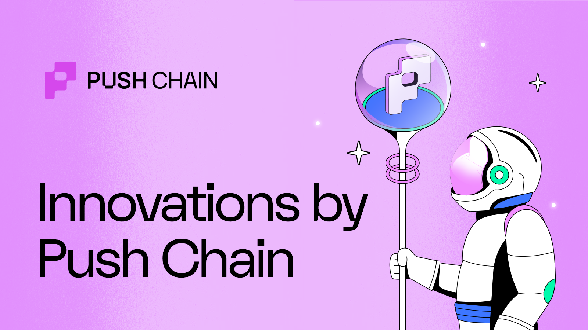
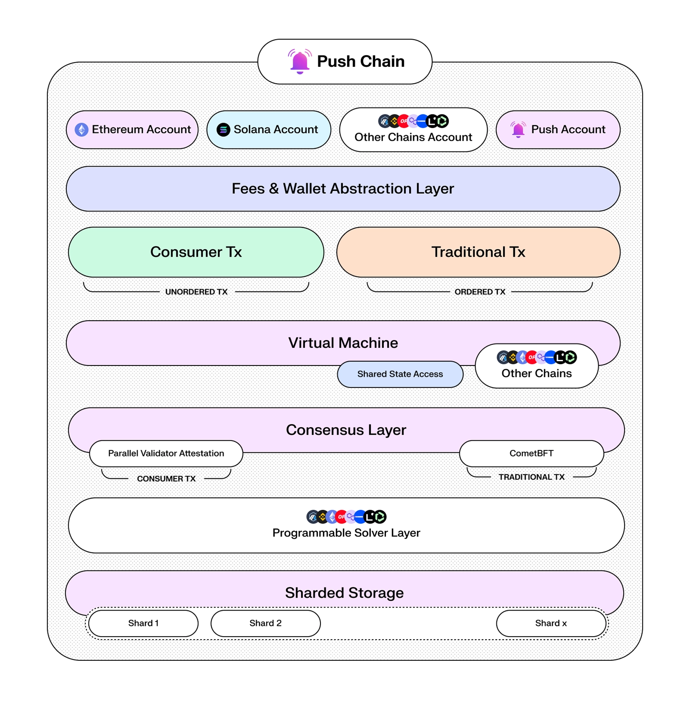
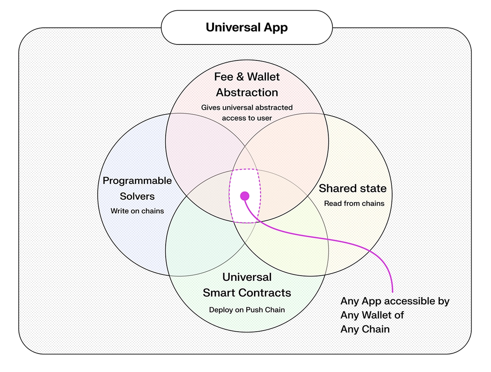

<!--truncate-->

## Introduction

Push recently unveiled its new layer 1 blockchain - Push Chain, a shared state blockchain designed for universal apps - apps that are deployed once and can be used by users from any chain.

Unlike traditional Layer 1 chains, Push Chain introduces several key innovations and optimized mechanisms to unify any chain, any user, and any app.

This article will help you understand:

- What innovations Push Chain brings to web3
- How Push Chain enables any user to connect to any app from any chain
- How Push Chain is positioned to onboard the first billion users to web3 (for real!)

### TLDR;

[Push Chain](https://push.org/chain/) is a Proof of Stake shared state blockchain designed to support the development of hyper-scalable, consumer-centric, universal web3 applications by unifying settlement from any L1s, L2s and L3s.

<!-- architecture diagram -->

Key Innovations and Superpowers of Push Chain include:

→ 1. **Blockchain agnostic wallet addresses**

→ 2. **Support Txns from any chain**

→ 3. **UniversalFee Abstraction**

→ 4. **Wallet Abstraction**

→ 5. **Single Transaction, no matter the chain**

→ 6. **Universal Smart Contracts**

→ 7. **True Identity and Cross-Chain Mapping**

→ 8. **Shared State and Programmable Solvers (Roadmap)**

Let’s take a closer look at each of these innovations and enhancements.

## Innovations By Push Chain

### 1. Blockchain agnostic wallet addresses

For Apps to support users from any chain and achieve **universal compatibility** - there must be a way to identify, interpret and transact with addresses incoming from various chains.

As a shared-state blockchain, Push Chain is designed to parse and handle blockchain addresses alongside the specific chains they originate from.

For instance, Push Chain can identify and support Solana, EVM, Cosmos and any other chain’s addresses.
To achieve this, Push Chain fully adopts [CAIP-10](https://github.com/ChainAgnostic/CAIPs/blob/main/CAIPs/caip-10.md) blockchain-agnostic wallet addresses, enabling it to deduce the chain, network, and address associated with each transaction ensuring universal compatibility across multiple blockchain ecosystems.

### 2. Support Txns from any chain

In addition to parsing addresses across various chains, Push Chain supports transactions from any wallet, regardless of the originating chain—be it Ethereum, Solana, or any other network.

Push Chain achieves this by accepting signed payload data and supporting the native signers of individual chains. Validator nodes then verify these signatures → conduct pre-transaction checks (such as fee validation) → and then admit the transactions to the network.

<!-- Here’s a quick demo of an app that lets you send transactions to Push Chain from any chain of your choice.

<video width="640" height="360" controls>
  <source src="./simulate_push_chain.mp4" type="video/mp4" />
</video> -->

To clarify, a user doesn’t have to “bridge” to another chain to use our platform. Instead, the app becomes universal and available to all users of any chain.

### 3. Universal Fee Abstraction

With web3’s progression towards true interoperability, the necessity to hold native tokens for basic interactions creates unnecessary barriers in what should be a borderless ecosystem.

**Push Chain’s Fee Abstraction eliminates these digital borders, ensuring universal accessibility and removing the economic friction of owning native tokens for network fees.**

- **Universal Gateway Contracts** 
  Fee contracts on every chain convert native tokens to cover fees automatically—no explicit swaps for Push Chain’s tokens are required.

- **Bulk Fee Payments** 
  Lock and release fees in bulk, then send them to Push Chain directly in the transaction. This removes the bottleneck of waiting on a specific blockchain’s speed.

- **Delegated Fees** 
  Wallets or web3 apps can cover fees, enabling a web2-like UX where the “website” pays for the user.

These mechanisms bridge web2 paradigms into web3 enabling web2 UX in a web3 world enabling any user of any chain to simply interact with the app and not have to worry about the fees.

### 4. Wallet abstraction

Wallet abstraction provides a flexible, **embeddable wallet experience**, tailored to individual user journeys enabling any wallet from any chain to connect, interact and transact with Push Chain.

- **Degens (aka existing web3 users)** 
  Well accustomed to the fragmented UX, have app & chain specific preferences for every on-chain activity. These users already are using wallets like Metamask, Phantom, etc and are already in a blockchain ecosystem like Ethereum, Solana, etc.

  For these users, Push Chain provides a seamless onboarding experience by allowing them to use their existing wallets like Metamask, Phantom, etc along with whatever native chain they are on for both sending transactions and funding the fees.

- **Normies (aka new web3 users)** 
  New or casual users unfamiliar with web3 complexities. Ones who are not comfortable with the idea of setting up a wallet.

  For these users, Push Chain offers a seamless onboarding experience by allowing them to use their email or social account to connect to the app and transact with Push Chain.

### 5. Single Transaction, no matter the chain

User experience is the most important part of any app. Creating a powerful tech stack is only half the battle. Which is why Push Chain only ever requires a single transaction to be sent by the user, no matter from which chain they choose to interact with the app.

This is made possible by optimizing the transaction flow to be as simple as possible.

- **New wallet of another chain doing a transaction** - Transaction hash is bundle with fee locking on universal gateway contracts ensuring single transaction.

- **Existing (onboarded) wallet of another chain doing a transaction** - If the wallet has enough gas, the universal gateway contract is surpassed and the transaction is sent directly to the chain.

### 6. Universal Smart Contracts

Push Chain is a fully EVM compatible chain. Any EVM compatible smart contract can be deployed on Push Chain with **zero on-chain code changes** to instantly become compatible with all L1s (including non-EVM chains).

Just deploy in minutes and instantly 10x your userbase.

### 7. True Identity and Cross-Chain Mapping

Contracts on Push Chain automatically recognize the wallet of the user and the chain they are on. This allows the contracts to know the entire state of the user and the chain they are on enabling developers to create apps that were not possible before.

Imagine multi-chain enabled safes, prediction markets accessible by all users, poker games played between different chains, defi that can tap into liquidity from all chains, and so much more!

### 8. Shared State and Programmable Solvers (Roadmap)

<!-- shared state diagram -->

- **Shared State** 

Shared state allows Push Chain to access data from any supported external chains in the smart contract, further giving power to developers to enquire and act on the state of a wallet or a smart contract from any other chain.

With shared state, you can read wallet activities like NFTs, DeFi positions, governance participation, and so much more!

- **Programmable Solvers** 

Programmable solvers on the other hand enables developers to give atomic instructions of what they want to execute on other chains from the smart contract.

## Conclusion

We started from users of any chain able to access app on Push Chain but once Push is done - we will finally see a world where users of any chain are able to interact with apps on any other chain.

All while making sure that the developers or users don't pay a price for it - neither in terms of learning curve, multiple deployments, maintaining multiple codebases or complexity of the code.

**Let's Build Universal Apps!**
