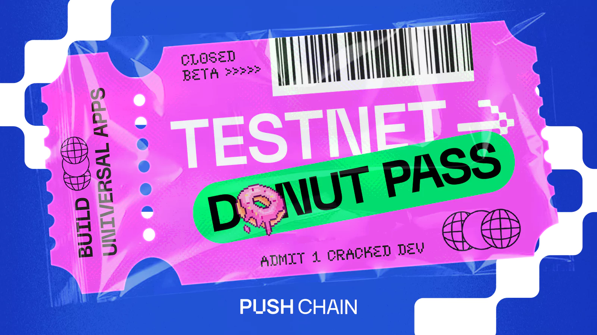

<!--truncate-->

## Donut Testnet Closed Beta is Now Live!

**We’ve been building the foundation for a new era of universal apps.** Now, we're opening the gates. Push Chain's **Closed Beta Pass** is here.

This is your chance to be the first to preview our Testnet, Donut. Selected developers will get hands-on with our SDK, UIKit, tooling, docs to be the first to deploy their app on Push Chain.

This guide will walk you through how to join and start building on **Donut**.

**👉 [Join the Closed Beta](https://t.me/+dHOCilvxNR9jZjM9)**

## 👀 What Early Access Unlocks?

### 🔧 **Powerful SDK, UIKit, Tooling and easy to follow Docs**

Start exploring and building with our [**comprehensive documentation**](https://pushchain.github.io/push-chain-website/pr-preview/pr-1067/docs/chain/?utm_source=blog&utm_medium=content&utm_campaign=devdocs).

Use the SDK, 10x your user base, unlock cross-chain liquidity with 100% EVM compatibility. Deploy your app with minimal code changes in minutes.

### 💸 **Rewards for Early Testers**

Up to $500 rewards & exclusive unlocks for testing, deploying, and providing quality feedback. Deploying an app on Push Chain Testnet qualifies for extra points (Developer Exclusive Airdrop).

### 💬 **Private Builder Group**

Direct line to Push Chain Core devs & other cracked devs participating in the closed beta.

Network, team up and learn from the best! Also, unlock special Invites to community meets and private previews.

## 🍩 Why Donut?

The first Layer 1 built for Universal Apps. Build & Deploy once, onboard users from any chain.

**✅ Deploy once, go cross-chain & 10x your user base.**

**✅ Skip bridges. Deploy Universal Smart Contracts with Wallet/Fee Abstraction, Any Chain TX & 100% EVM compatibility.**

**✅ Create unique app experiences, by having users of different chains transact with the same app.**

## [🎟️ Claim your Donut Testnet Pass HERE](https://t.me/+dHOCilvxNR9jZjM9)

PS: *(Spots are limited, Early access closes soon)*
