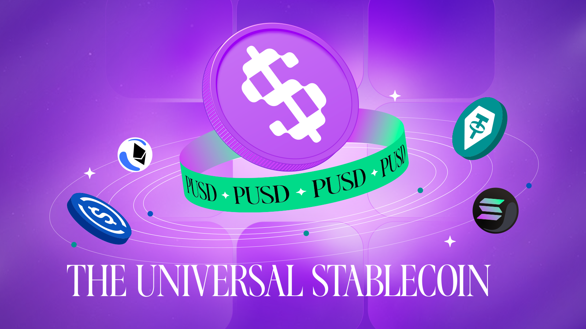
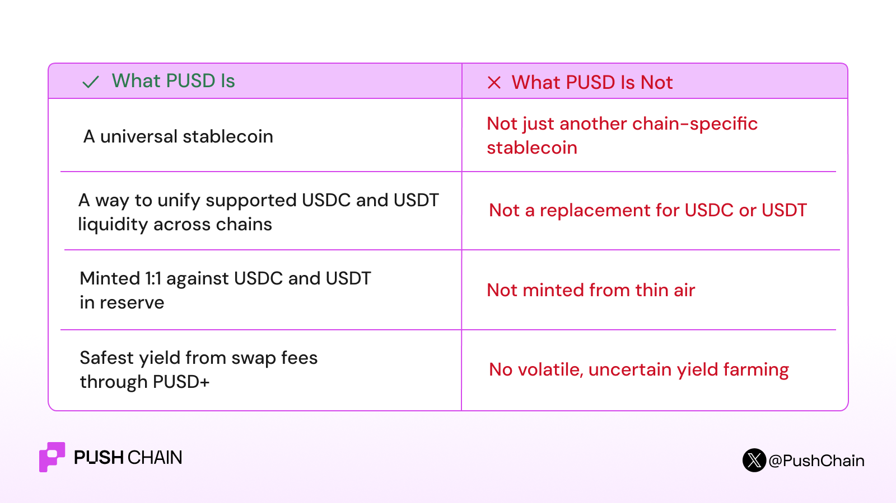

<!--truncate-->

import ReactPlayer from 'react-player';

[PUSD](http://pusd.push.org) is a universal stablecoin that unifies fragmented USDC, USDT liquidity from any chain to enable bridgeless, cross-chain asset movement. Every PUSD is backed 1:1.

This blog covers what PUSD is, why we need it, what it is not, its unique features, and how it aims to power the next generation of universal apps and blockchain-native payments, while also enabling passive income opportunities for users.

## Challenges users and businesses face

Stablecoins are everywhere in crypto, but using them is still not as simple as holding a “digital dollar.”

One has USDC on Base, USDT on Ethereum, or USDC on Solana, but the dilemma is always multifold

- Does the app support it?
- Do I need to bridge first?
- Will the recipient /vendor accept this version of the stablecoin?
- Can I withdraw into the chain I actually want to use?
- Are stablecoin yield platforms safe enough?

So even when the user already has stablecoins, they still have to think about bridges, supported assets, approvals, destination chains, withdrawal routes, and whether the stablecoin in their wallet is the “right” one for the action they want to take.

Now, if you zoom out and try to apply this workflow for bigger organizations, teams and events, the implications are massive: both in terms of time and resources wasted.

That is the problem PUSD is built to solve.

## Missed opportunity:

PS: There's over $320 billion in stablecoin liquidity across 50+ chain-token pairs. But none of it is shared. An app on Arbitrum can't tap USDC liquidity sitting on Solana. A prediction market on Base can't settle with USDT locked on Ethereum.

PUSD is designed to remove that problem at the application layer.

**The goal is simple: make stablecoin usage feel less fragmented for users and easier to build around for developers by utilizing Push Chain’s  universal execution layer**

## What is PUSD?

**1:1 stablecoin minting**
Users deposit USDT, USDC from any supported EVM, non-EVM chain into the [PUSD App](http://pusd.push.org) and receive an equivalent amount of PUSD on Push Chain.

Once minted, PUSD can be used for payments, trading, app interactions, or converted into PUSD+ for yield. *Read more use cases below*.

**Backed by reserves, not printed from thin air**
Every PUSD is backed by reserve assets. The system is designed around reserve accounting, not speculative expansion.

**Universal stablecoin liquidity for Push Chain apps**
Instead of every app needing to support every chain-specific version of USDC or USDT, apps can integrate PUSD as the common stablecoin layer.

Integration takes a few hours, not months. [Refer the guide here](https://pusd.push.org/docs/).

**Instantly redeemable into chain-specific stablecoins**
Users can burn PUSD and redeem it back to required stablecoins. 

**Universal means Universal:**
PUSD is built for a multi-chain world. A user may enter with stablecoin liquidity from one chain and redeem into another supported chain, depending on available reserves and routing.

**PUSD+ for yield-bearing exposure**
PUSD+ is the yield-bearing side of the system. Yield comes from activity around internal stablecoin swaps and rebalancing, with fees distributed back to PUSD+ holders.

## How to mint PUSD?

<ReactPlayer
  controls
  width="100%"
  url="https://www.youtube.com/watch?v=4og-TfBwYKY"
/>

Mint here: [http://pusd.push.org](http://pusd.push.org)

## Safest Stablecoin Yield

PUSD+ is the yield-bearing version of PUSD. Because PUSD pools stablecoins from multiple chains, Push creates Uniswap-style swap pools (e.g., USDC.eth ↔ USDC.sol pairs) via [Ramen.fi](https://www.ramenfi.xyz/). Swap fees from these pools flow back to PUSD+ holders

The yield is not based on aggressive farming, leverage, volatile collateral, or uncertain hidden DeFi strategies making it the safest yield strategy 100% backed by stablecoins.

## How to earn yield on PUSD?
<ReactPlayer
  controls
  width="100%"
  url="https://www.youtube.com/watch?v=ZyyVTGD9EdA"
/>

## Early Usecases

**Pay anyone, on any chain:** You have USDC on Solana. The person you're paying needs USDT on Arbitrum. With PUSD, the chains don't need to match and the stablecoins don't need to match. Deposit, send, the recipient redeems on their chain.

Check out [Zappi.to](http://zappi.to): An instant payment app for inide hackers and freelancers. Receive payments in stablecoins in seconds instead of weeks.

**Predict and trade across chains**
Prediction markets today only accept stablecoins on their native chain, which cuts out users on every other chain. 

A prediction market settling in PUSD lets anyone from any supported chain place a bet with whatever stablecoin they already hold. No bridging before every trade.

This is just a glimpse. [PUSD](http://pusd.push.org) is more than a stablecoin, it’s the liquidity layer designed for a multi-chain, blockchain native payments future.

## TLDR;

