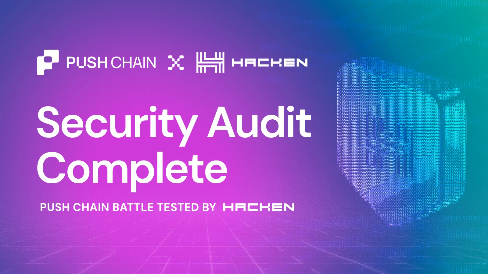

<!--truncate-->

# **Push Chain Completes Hacken Security Audit, $100,000 Bug Bounty Launching Soon**

Push Chain is a complex system \- it lets users from *any* chain, settled in one place. No bridges, gas in any token. Behind the scenes it means coordinating contracts and infrastructure across several networks at once.

A system with that many moving parts deserves rigorous, independent scrutiny to protect user funds, and launch with confidence. So we partnered with [Hacken](https://hacken.io/), a leading web3 security firm that has audited major ecosystems including NEAR, Solana, MetaMask, BNB Chain, ByBit, Base and TON. Hacken’s smart contract audit combines senior-led code review, structured testing, and real-world exploit analysis – trusted by 1,500+ projects securing over $180B+ in digital assets.

Between March and June 2026, Hacken conducted a full security audit program across Push Chain \- covering our ***cross-chain gateway contracts on both EVM chains and Solana, our core contracts on Push Chain, and a protocol-level assessment of the Push Chain node itself.***

Today we're sharing the results.

**The most important result: no critical-severity findings were identified across any of the four audit engagements.**

## **Key Outcomes**

* 3 smart contract and full chain audit was completed across Push Chain infrastructure
* No critical-severity findings across any audit
* All High and Medium findings resolved, mitigated, or formally acknowledged
* Final audit reports delivered by Hacken
* Dual Defense bug bounty launching soon with rewards of up to **$100,000**

## **The Security Audit Scope**

The audit program spanned four separate engagements, each with its own scope, methodology, and report:

1. **EVM Gateway contracts.** The `UniversalGateway` and `Vault` contracts deployed on external EVM chains such as Ethereum, Base, Arbitrum, etc. These are the contracts that accept user deposits, hold bridged assets in custody, enforce per-transaction and per-block value caps, and release funds on TSS authorization. This is the highest-value custody surface in the system.
2. **SVM Gateway contracts.** The Solana-side gateway program, written in Rust with the Anchor framework. It mirrors the EVM gateway's role for Solana users \- locking deposits in a PDA-controlled vault and releasing them through TSS-signed outbound operations.
3. **Core contracts.** The contracts deployed on Push Chain that make universal execution work, including `UniversalCore`, the `UEAFactory` and `CEAFactory`, the Universal and Chain Executor Account implementations, and the PRC20 synthetic token standard.
4. **Push Chain node.** A protocol-level assessment of the Cosmos SDK and EVM node (`pchaind`), covering the custom universal modules \- registry, validator voting, on-chain execution, and threshold-signing coordination \- and the EVM precompiles that let Solidity verify signatures from other chains.

Across these engagements Hacken applied manual review by senior security researchers alongside property-based fuzzing and fork testing.

The smart-contract suites carried strong automated coverage going into the audit, with line coverage above 95% on the SVM gateway and high branch coverage on the core and EVM contracts.

The protocol-level review followed recognized standards including NIST SP 800-115 and the Penetration Testing Execution Standard.

## **Audit Findings**

The most important result first: **No critical-severity issues in any of the four audits.**

Across the three finalized smart-contract audits \- EVM Gateway, SVM Gateway, and Core Contracts and Push Chain Node \- every High and Medium severity finding was resolved, mitigated, or formally acknowledged before the reports were finalized.

We treat that distinction honestly: most findings were fixed in code and re-verified by Hacken; a small number of low or informational issues were formally accepted as intended design decisions, with the reasoning documented; and a few were mitigated where a complete fix sat outside the audited scope.

We don't view the findings that surfaced as a problem to hide. We view them as the entire point of the exercise. A few examples of how the review made the system stronger:

* **Granular role separation across the contract suite.** The audits prompted us to move to a production-grade access-control model \- a layered role hierarchy where role management, configuration, operations, and pause authority are held by distinct roles rather than a single key, limiting the blast radius if any one key is ever compromised.
* **Stronger custody and authorization guarantees.** Findings on the SVM gateway led us to enforce canonical vault token accounts so bridged liquidity can't be fragmented, to authenticate previously unsigned cross-chain revert data, and to separate pause authority from unpause authority so re-enabling the system after an incident requires higher assurance.
* **Safer administrative operations.** We introduced two-step authority transfers so a privileged role can never be handed to an uncontrollable address by a single mistaken transaction, and we bounded protocol-fee configuration to remove the possibility of an unbounded fee.

The full reports document every finding, its severity, and its resolution. We're publishing them so that anyone \- users, builders, or other auditors \- can read the complete picture rather than take our summary on faith. Specifically for builders, it means you're deploying on a chain whose universality layer has been reviewed by people outside our team. The parts of Push Chain you can't audit yourself \- the cross-chain custody, the signature verification, the executor account model \- are exactly the parts Hacken focused on.

The review of the fixes done by the Push Chain team is now complete.

After a final re-verification and extensive review, Hacken has now provided the Final Audit Reports.

## **Beyond the Audit: A Bug Bounty of Up to $100,000**

An audit is a point-in-time review of a specific commit. It is necessary, but it is not sufficient \- and Hacken's own guidance is explicit that no project should rely on an audit alone.

So alongside the completion of this audit program, we'll soon be launching a **Hacken-hosted bug bounty for Push Chain, with rewards of up to $100,000** for qualifying vulnerabilities. This turns security from a milestone into a standing invitation: the more eyes we have on the code as we move toward mainnet, the safer the system becomes for everyone building and transacting on it.

## **What's Next**

Now that the security audit program is complete, the work doesn't stop here.

The audit and the bug bounty program that now sits alongside it are part of the same goal: ensuring that Push Chain's contracts and the chain itself remain secure, reliable, and dependable for everyone who builds and transacts on them.

With security as a foundation, our focus now shifts to the ecosystem. We're working to onboard flagship applications so that when mainnet goes live, there are real products and use cases available from day one.

The completion of this audit program marks an important milestone for Push Chain, bringing us one step closer toward our broader goal: making blockchain feel universal.

The full audit reports are linked below \- we encourage you to read them.

*Read the full Hacken audit reports:*

* *[EVM Gateway report](https://github.com/pushchain/push-chain-gateway-contracts/tree/audit-main-fixes/contracts/evm-gateway/audits)*
* *[SVM Gateway report](https://github.com/pushchain/push-chain-gateway-contracts/tree/audit-main-fixes/contracts/svm-gateway/audits)*
* *[Core Contracts report](https://github.com/pushchain/push-chain-core-contracts/tree/audit-main-fixes/audits)*
* *[Push Chain node report](https://github.com/pushchain/push-chain-node/tree/audit-fixes/audits)*
