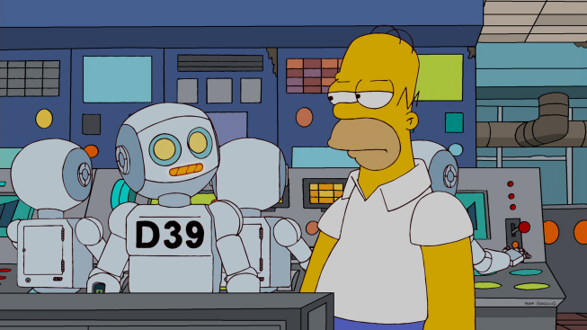
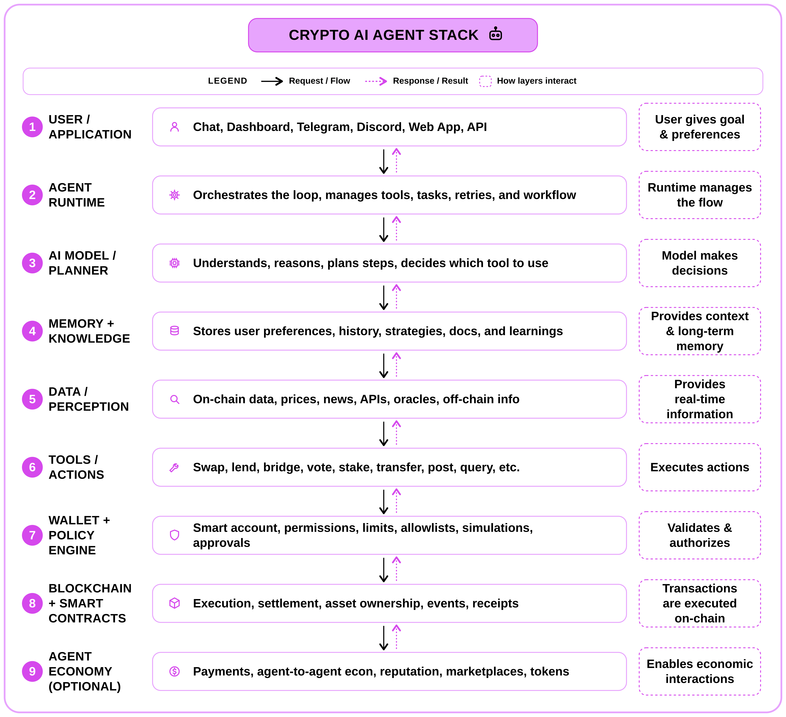

<!--truncate-->

- There are more than **600,000 active agents** currently operating on-chain across various ecosystems
- In april x402 ecosystem alone recorded: **480,000+ transacting agents**
- **That executed over 165 million+ transactions with over $50 million in payment volume**

We are entering a period of massive opportunity for both developers and users. By building and using onchain AI systems, we can automate complex workflows, improve operational efficiency, and unlock entirely new revenue models.

To participate in this shift, however, you need at least a high-level understanding of how onchain AI agents work.

P.S. They are very different from the everyday AI tools and chatbots most of us currently use.

## What makes this article different?

- A purely educational piece. No project or tool shilling. Strictly NFA
- A complete overview of the crypto AI agent stack in under 500 words.
- Written for both users and builders, regardless of technical background.

## Crypto AI Agent Stack Explained Layer-wise

### Layer 1: User and application

This is where a human or another application gives the agent a goal.
Eg: “Always balance  my portfolio 60% ETH and 40% USDC.”
“Pay for a market-data API and prepare a report.”
“Find the best USDC lending yield on Solana and bridge and deposit the 100 USDC from my Base Metamask Wallet”

User specifies intent through an interface like an app frontend or a messaging app, rather than manually executing every step on the blockchain.

### Layer 2: Agent runtime

Think of the runtime as the operating system of the AI agent. It orchestrates the entire execution loop:
Receive goal → Collect context → Ask the model to decide → Select a tool → Execute the tool → Observe the result → Stop or continue

Frameworks such as elizaOS organize agents around runtimes, plugins, providers, actions and services. Providers give the agent information, while actions let it do something.

Coinbase AgentKit focuses heavily on adding wallets and onchain actions to different agent frameworks.

### Layer 3: AI model and planner

This is the agent's reasoning engine.
It interprets natural language, breaks complex objectives into executable steps, decides which tools to call, and generates a plan.
Models could include GPT-5, Claude, Gemini, DeepSeek or specialized home trained models.
Eg:  Current ETH allocation: 70% Target ETH allocation: 60% Action required: Sell some ETH for USDC

model doesn't execute transactions itself. It simply decides what should happen next. The runtime and tool layer translate those decisions into deterministic blockchain actions.

### Layer 4: Memory and knowledge

Memory allows the agent to remain stateful instead of treating every request as a brand-new conversation.
Most agents maintain three kinds of memory:

1. **Working Memory**: temporary context for the current task.
2. **Long-term Memory**:  persistent user preferences, transaction history, and learned behaviours.
3. **Knowledge Base**: could include external references such as protocol documentation, governance rules, whitepapers, APIs or trading strategies.

Agent frameworks commonly provide persistent conversation, knowledge and state storage so agents can retrieve past context before choosing an action. 

### Layer 5: Data and perception

This is how the agent observes the world.
Reading raw blockchain history directly is difficult. Indexers organize events into queryable datasets.
Depending on the task, it continuously consumes both onchain and offchain data:
like balances, liquidity, market prices, active positions and news/social sentiments.
This is where indexers and oracles come into play.
This layer is typically powered by RPCs, indexers like The Graph, oracle price feeds like Chainlink, , external APIs and universal execution layers like Push Chain.

### Layer 6: Tools and action adapters

If the model is the brain, tools are its hands.
The AI never directly interacts with a blockchain. Instead, it invokes predefined tools that safely translate its decisions into deterministic operations.
An abstract decision could look like: “Reduce ETH exposure.”
Tool call: swap( token_in = ETH, token_out = USDC, amount = 0.4 ETH, max_slippage = 0.5% )

Typical crypto tools include: Register an agent, Transfer tokens, Mint an NFT, Bridge assets, Create a limit order
Push Chain’s TAP, Coinbase AgentKit, for example, exposes wallet operations and onchain actions through action providers and integrates with several agent frameworks

### Layer 7: Wallet, identity and policy engine

A wallet gives an agent the power to

* Hold assets
* Maintain an identity
* Sign Transactions
* Receive payments

The policy engine sits between the AI and the wallet, enforcing deterministic guardrails such as:

Maximum per transaction: $100
Maximum per day: $500
Allowed tokens: ETH, USDC
Allowed protocols: Uniswap, Aave
Maximum slippage: 0.5%

There are more than 250,000 ai agent agents in crypto, but today NONE OF THEM can easily operate cross-chain because there isn't any way to:

> preserve an agents identity across chains
> have an aggregated reputation score

[Trustless Agent Plus (TAP)](https://github.com/zaryab2000/create-8004-TAP-agent) framework on Push Chain fixes this

### Layer 8: Blockchain and smart-contract execution

This is the execution and settlement layer.
The AI usually thinks **offchain**, while the blockchain handles:

- Asset ownership
- Balances
- Transaction ordering
- Contract execution
- Settlement
- Receipts

It is very crucial for the agent as well as the projects building such agents to measure their performance to ensure transparency.

Moving forward, as crypto becomes an ai dominated industry, performance benchmarking will be an integral part of the industry. Assisting everyone, from retail to B2B as well as institutions.

### Layer 9 - Agent Economies

This layer allows agents to participate in more complex economic activities beyond executing one-off transactions for a single user.
Once an agent has a wallet, identity and access to tools, it can:

* Pay for APIs, data or compute.
* Receive payment for completing tasks.
* Hire another specialized agent.
* Participate in marketplaces or service networks.

In the coming weeks we'll dive deeper into crypto ai agents and understand how they work behind the scenes, what are the untapped building opportunities in this space and how can you make the most of it, both as a dev and a user!

Watch this space.
