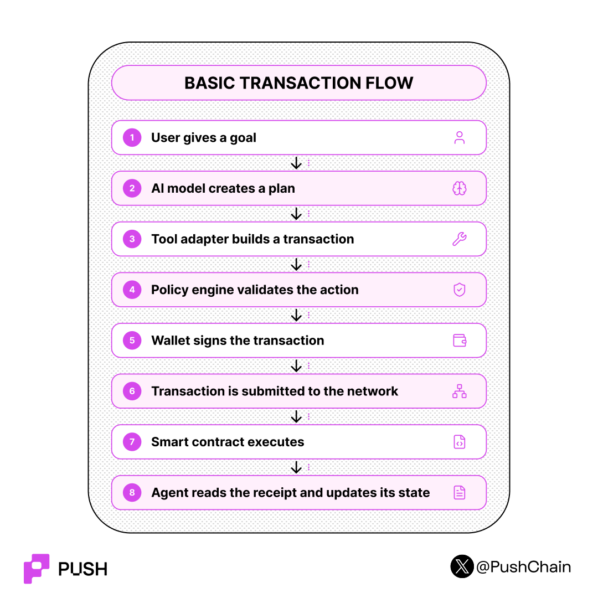

<!--truncate-->

Today, crypto agents are initiating more than 25% of all onchain trades. **3X JUMP from the last two years!!**

These agents have already crossed **$3 billion in market cap** and are processing over **$100 million** in volume every week.

So how is the infrastructure, which was originally built for manual human actions like browser wallets and manual txn signing is able to reliably support and power autonomous agents operating 24/7 across multiple chains??

Time to find out how.

Quick TL;DR:

## What Is Inside a typical onchain Transaction?

On an EVM chain, a standard transaction usually contains:

- **to** → Contract or recipient address
- **value** → Native asset being transferred
- **data** → Encoded smart-contract function call
- **nonce** → Sender’s transaction sequence number
- **gasLimit** → Maximum computation allowed
- **maxFee** → Maximum gas price the sender will pay
- **chainId** → Network on which the transaction is valid
- **signature** → Cryptographic authorization

On non-EVM chains like Solana, the packaging is different. A transaction contains signatures and a message composed of account addresses, a recent blockhash and one or more program (smart contract)  instructions.

**Let's walk through an example:**

*“Swap 0.4 ETH for USDC with a maximum slippage of 0.5%.”*

The AI model decides that a swap is required. A predefined swap tool then converts that decision into contract-compatible data.

The tool identifies the relevant contract, calculates the minimum acceptable output and encodes the function call. The blockchain never sees the original prompt; it only receives transaction data.

## How Does an AI Agent Sign Transactions?

There are two common architectures.

### 1. Direct wallet signing

The agent controls an externally owned account or a managed wallet. The signing key may be stored in secure infrastructure rather than directly inside the AI model.
The model proposes the action; the wallet system performs the cryptographic signing.

**BUT THIS IS A VERY INSECURE METHOD!**

An EOA private key grants unlimited, overarching spending authority.
If an AI agent is given a raw private key and suffers a prompt injection attack, software bug, or dependency compromise, the attacker gains full access to drain the wallet. 

EOAs do not natively support spending limits, recipient whitelists, or time delays. To safely deploy agents that handle real value, the spending logic must be enforced at the blockchain level, not just within the application code.

To give agents secure wallets, developers utilize **ERC-4337 Account Abstraction**. This standard replaces raw private keys with smart contract accounts.

### 2. Smart-account execution

Over 40 million of these smart accounts have been deployed across Ethereum and Layer 2 networks.
Instead of broadcasting standard transactions to the mempool, agents generate **UserOperations**. A UserOperation is a pseudo-transaction object that contains the sender's details, the action to execute (calldata), gas limits, and custom validation fields. This architecture allows the smart account to run programmable verification logic before authorizing the spend.

## Session Keys for Granular Control

To operate autonomously without requiring a human to sign every micro-transaction, an agent uses **Session Keys**. A session key authorizes specific transaction types without giving the agent root control of the wallet.

A platform can provision a session key for an agent with strict parameters:

* **Maximum spend per transaction:** e.g., capped at $50.
* **Approved recipient lists:** The agent can only interact with pre-vetted smart contracts (like a specific DEX router or yield protocol).
* **Time boundaries:** The session key expires after exactly 24 hours.
* **Total budget:** The agent can only spend a cumulative $500 before requiring a human to re-authorize.

## How Agents Pay for APIs and Other Agents

Machine-to-Machine Payments are enabled by the [x402 Protocol](https://x402.org/wp-content/uploads/sites/10/2026/06/x402-whitepaper.pdf)

Agents cannot realistically stop to navigate a checkout flow or input credit card details for every offchain purchases like API credits or online shopping.

The x402 protocol solves this by repurposing the standard HTTP "402 Payment Required" status code for machine-to-machine crypto payments.

The transaction flow works like this:
1. **Request:** The agent requests a resource from a server.
2. **Payment Required:** The server rejects the request with a 402 status, attaching a header that details accepted payment networks, token prices, and destination addresses.
3. **Payment Signature:** The agent automatically builds and signs a payment payload matching one of the server's accepted options, then resubmits the request with the payload.
4. **Verification and Settlement:** The server (often using automated payment facilitators) verifies the payload, settles the payment on-chain, and delivers the requested data to the agent.

## Summary:
AI agents do not directly “talk” to blockchains.

They:
1. Interpret an objective
2. select an approved tool
3. construct a chain-specific transaction
4. validate it against deterministic policies
5. sign it through a wallet or smart account
6. submit it through an RPC or bundler
7. observe the resulting state change
