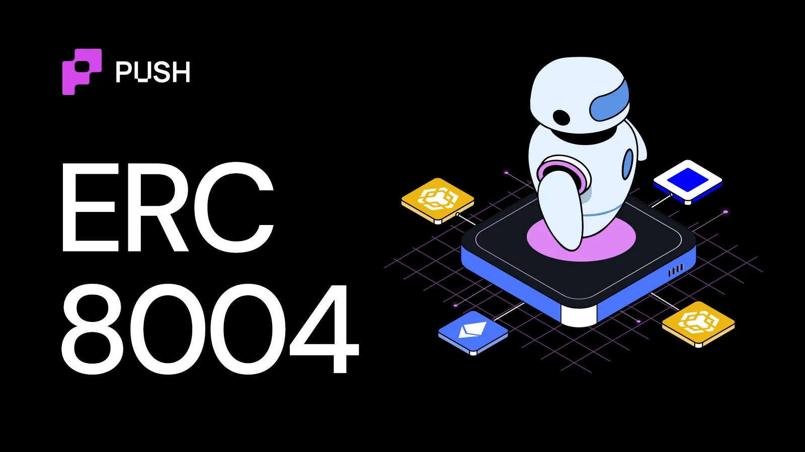
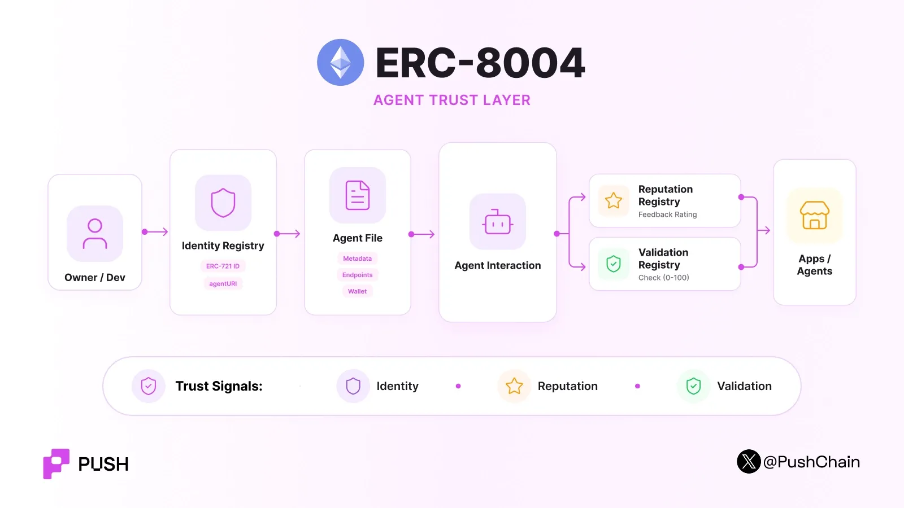

<!--truncate-->

Consider an open marketplace of thousands of AI agents. Where one agent can employ other agents to coordinate given tasks.

Let's say agent A is looking for an agent that provides smart contract auditing services.

Another agent, say agent B, says *"I can analyze this smart contract for $5."*

Now on what basis would Agent 'A' decide whether Agent 'B' is the best choice for the job?

Can't just assume word for word, right !?

Agent 'A' still needs answers to questions like:

- Is this the correct agent?
- Has anyone used it before?
- Did previous tasks succeed?
- Can another system verify its work?

It all boils down to one empirical question: **How should we (humans) and agents find and trust other agents?**

This is exactly what ERC-8004 solves.

## What is ERC-8004?

[ERC-8004](https://eips.ethereum.org/EIPS/eip-8004) is an Ethereum standard for discovering agents and creating trust signals about them.

It gives AI agents a common on-chain system for identity, reputation, and validation. Its goal is to let agents work across different organizations without pre-existing trust.

ERC-8004 consists of three main components (or registries):

1. Identity Registry
2. Reputation Registry
3. Validation Registry

**Caveat:** ERC-8004 does not put a complete AI agent onchain. The agent can still run on a server, in a Trusted Execution Environment, or in another computing system.

The blockchain stores the parts that need a common and public source of truth.

## Decoding ERC-8004 Registries

### Identity Registry

The Identity Registry gives each agent a unique on-chain identity. This identity is minted as an ERC-721 NFT.

Each registered agent gets an **agentId**. The NFT owner controls the agent identity. The owner can also transfer the identity to another owner.

This NFT points to a JSON file, also commonly known as an **Agent Card**, which includes all the metadata about the agent, including its name, service endpoints (A2A, MCP), payable address, functionalities and more.

### Reputation Registry

The Reputation Registry stores feedback about an agent's past performance.

Any client can submit feedback for a registered agentId. The agent owner and approved operators cannot review their own agent.

Feedback can be provided in two ways: **Numerical** and **Categorical (tags)**.

For numerical, example:

```
Quality       = 87 / 100
Uptime        = 99.77%
Success Rate  = 89%
Response Time = 560 ms
```

And categorical tags could be: `"uptime"`, `"month"`

**Caveat:** ERC-8004 does not define one universal reputation score.

It stores standardized feedback signals. Applications can decide how to filter, weight, and combine them.

### Validation Registry

Provides a standardised mechanism for evaluating and recording the agent's work as an onchain verifiable evidence.

The registry stores independent checks of an agent's work.

The registry does not check the work itself. A separate validator does the check. The registry records: What was checked, who checked it and what the result was.

## How does ERC-8004 work?



A typical ERC-8004 flow has four stages:

### Step 1: Register the agent

The agent owner registers an agent in the Identity Registry, which then creates an ERC-721 token and assigns an agentId. The owner also provides an **agentURI**.

You can track and discover ERC-8004 registered agents at: [8004scan.io](https://8004scan.io)

### Step 2: Use the agent

A client discovers the agent.

The client can then call its MCP endpoint, send an A2A task, use its web service, or interact through another supported method.

### Step 3: Add reputation

After the interaction, the client can submit feedback to the Reputation Registry.

As discussed in the article above, the Reputation Registry can accept feedback in both numerical and categorical forms.

### Step 4: Validate important work

Here the agent can ask a validator of its choice to vet its work. Validators can use different verification methods.

For example:

- Re-run the computation.
- Use stake-secured verification.
- Check a zkML proof.
- Check a TEE attestation.

The validator returns a value from 0 to 100.

A validator can use 0 for failure and 100 for success. It can also use values between them when the result is not binary.

## What ERC-8004 does not do

- **ERC-8004 does not define payments.** Payment systems such as x402 can work with ERC-8004, but payments remain outside the standard.
- **ERC-8004 does not replace MCP or A2A.** MCP provides access to tools and resources, whereas A2A supports communication and task coordination between agents. ERC-8004 adds discovery and trust around these systems.
- **It does not guarantee an agent's safety.**
- **Fake accounts can also try to create a false reputation.**

## Why does it matter?

The internet has many ways to identify people, websites, and companies.

AI agents need a similar system. But agents also need something more. They need **machine-readable trust**.

An agent cannot read hundreds of human reviews before every transaction. It needs structured data that software can inspect. ERC-8004 provides the foundation for this model.

If you want to dig deeper into the AI x crypto rabbit hole, read about the [AI agent stack](https://push.org/blog/understanding-the-crypto-ai-agent-stack/) and [how agents transact onchain](https://push.org/blog/how-do-ai-agents-transact-onchain/).
