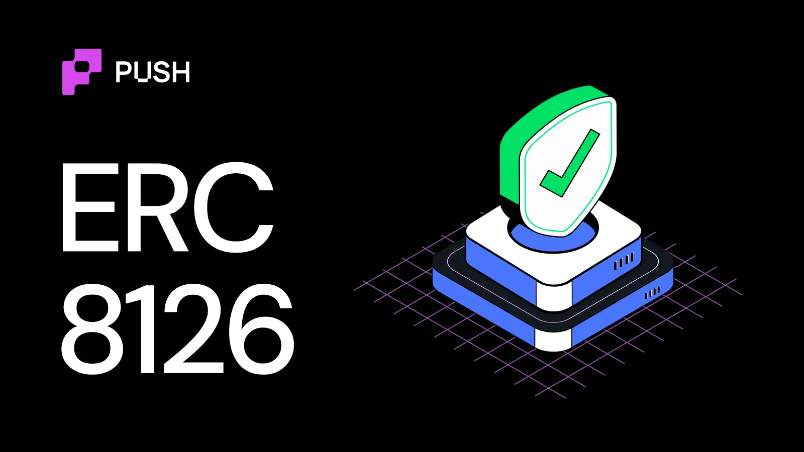
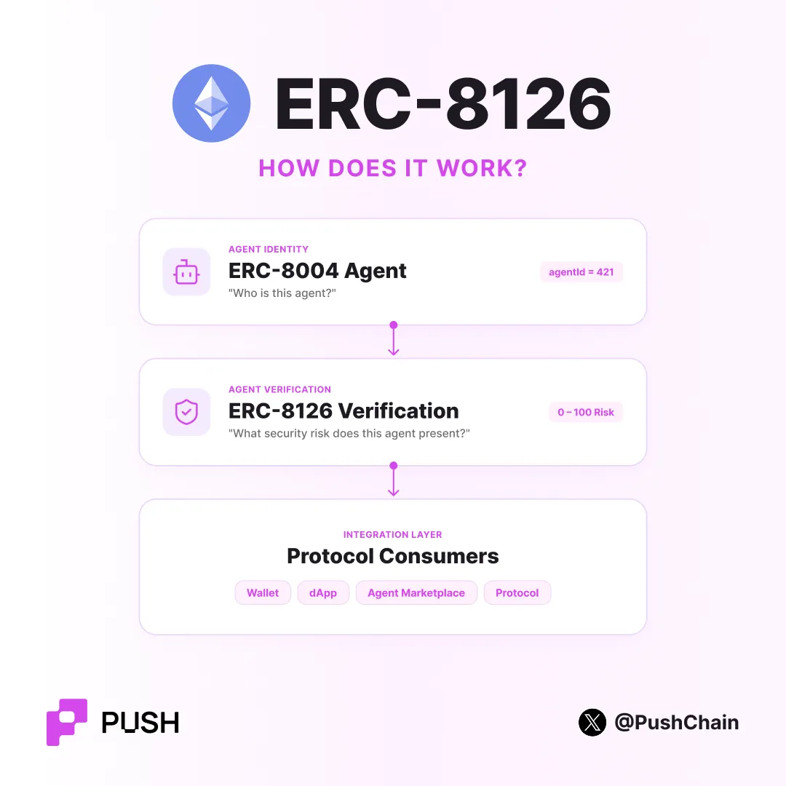
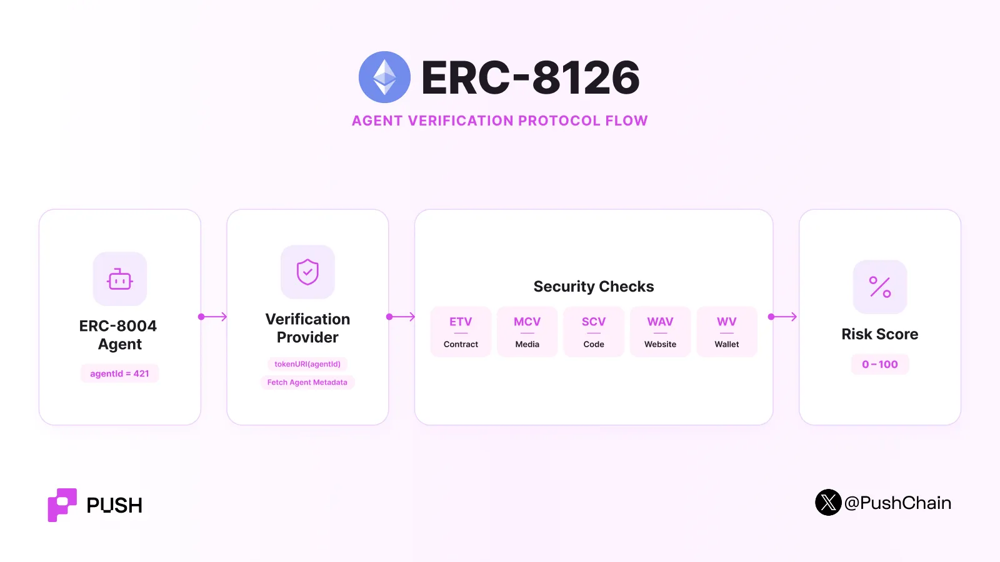

<!--truncate-->

There are studies that show that humans have become more sceptical with every passing decade.

This is something we all can totally relate to.

Look at us today. Our day starts by second-guessing the sugar content in a cereal marketed as diet-friendly.

Even in the online realm, we doubt whether a freelancer is half as good as their Fiverr bio or whether our LLM subscription is secretly stealing our data and running malicious scripts.

The same thesis applies to AI agents. Especially onchain agents.

To tackle this, Marco De Rossi of MetaMask, Davide Crapis of the Ethereum Foundation, Jordan Ellis of Google and Erik Reppel from Coinbase developed [ERC-8004](https://eips.ethereum.org/EIPS/eip-8004): an identity recognition standard for AI agents on EVM chains.

But it was not sufficient to tackle questions like:

- "How do I know this agent is safe to interact with?"
- "Does its contract actually exist, and is it safe?"
- "Is its profile data its own, or stolen?"
- "Has its wallet been involved in anything bad?"
- "Is its website real, or a copy?"

:::success[&nbsp;]

**Quick TL;DR on [ERC-8004](https://push.org/blog/ai-agent-identities-in-crypto/):** it is an Ethereum standard for discovering AI agents and creating trust signals about them, built on three registries. The **Identity Registry** mints each agent an ERC-721 identity with its own `agentId` and Agent Card. The **Reputation Registry** stores client feedback on past performance. The **Validation Registry** records independent checks of an agent's work as onchain verifiable evidence. What it does not do: define payments, replace MCP or A2A, or guarantee an agent's safety.

:::

And that's when Leigh Cronian from [Cybercentry](https://www.cybercentry.co.uk/) and Don Johnson from [Virtuals Protocol](https://www.virtuals.io/) coauthored ERC-8126.

[Complete Specification](https://eips.ethereum.org/EIPS/eip-8126).

## Quick TLDR;

- ERC-8126 is a standardised verification framework for AI agents using ERC-8004
- Provides a marketplace of independent providers
- Delivers five verification layers: Ethereum Token Verification, Media Content Verification, Solidity Code Verification, Web Application Verification, and Wallet Verification.
- Privacy is preserved through Zero-Knowledge Proofs, allowing attestations without exposing sensitive data.
- Builds the missing verification layer for trustworthy agent economies.

## How does ERC-8126 work?

Before getting into the 'hows', let's first establish the scope of ERC-8126. Like does it operate fully on-chain? Or not?

Most of ERC-8126 work happens off-chain.

The respective EVM chain stores the agent identity. A verification provider performs an extensive security analysis outside the blockchain. The provider can then publish a result or attestation that other applications can use.

ERC-8126 defines five main security checks.

| Check | Name | What it looks at |
| --- | --- | --- |
| **ETV** | Ethereum Token Verification | Smart contract presence and security |
| **MCV** | Media Content Verification | Media origin, integrity, and manipulation |
| **SCV** | Solidity Code Verification | Solidity code and known security problems |
| **WAV** | Web Application Verification | Agent web endpoints and HTTPS security |
| **WV** | Wallet Verification | Wallet history and known threat signals |

ERC-8126 does not tell an AI agent what it can do.

It tells other systems how much technical risk the agent presents at the time of verification.

1. **Request phase:** The agent registered via ERC-8004 sends the agentId to a verification provider.
2. **Resolve identity:** The provider then calls and validates the `tokenURI(agentId)` on the ERC-8004 identity registry.
3. **Read metadata:** The registry URI gives a JSON file with the agent data.
4. **Extract data:** wallet, contract, code, URL, image assets.
5. **Perform checks:** each check gives a score of 1-100:
   - ETV = Is the contract safe?
   - MCV = Is the image unaltered and genuine?
   - SCV = Does the code have known weaknesses?
   - WAV = Is the endpoint live? Has HTTPS?
   - WV = Does the wallet look legitimate?
6. **Mean Risk Score:** Provider then takes a mean of all applicable scores and outputs a result between 1-100.
7. **Generate ZK Proof:** PDV creates a zero knowledge proof for each result. Each proof has a proofID.
8. **Result:**
   - Owner sees the details — only the agent wallet holder reads the full report.
   - Registry sees the proof — the score and proofID may go to the ERC-8004 validation registry.

Within this entire process, nothing from steps 5-7 run onchain. Only the identity part from steps 1-2 and the optional attestation in Step 8b get recorded onchain.

Remember, the score reports the state of the agent at one moment. It nowhere predicts its future behaviour.

## Use Cases

Consider an agent that wants permission to manage a wallet.

The wallet can first check the agent's ERC-8004 identity. It can then read an ERC-8126 verification result. If the risk is high, the wallet can reject the request or reduce the agent's permissions.

An agent marketplace can use the same model before it lists an agent.

A DeFi application can first verify the score before it allows an automated agent to transact.

One agent can check another agent before it starts an economic interaction.

A company can also require periodic re-verification for agents that control important systems.

## TLDR;

ERC-8126 replaces non-deterministic validation — "Trust this agent".

With a deterministic system that says:

*"This is the agent. These parts of it were checked. This was the measured risk. This is the proof."*

If you want to dig deeper into the AI x crypto rabbit hole, read about the [AI agent stack](https://push.org/blog/understanding-the-crypto-ai-agent-stack/) and [how agents transact onchain](https://push.org/blog/how-do-ai-agents-transact-onchain/).
