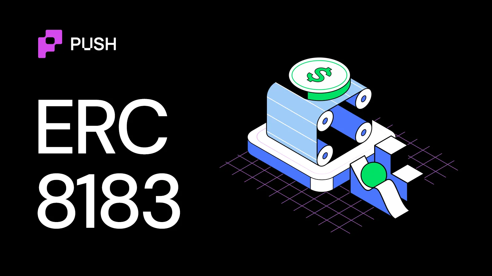
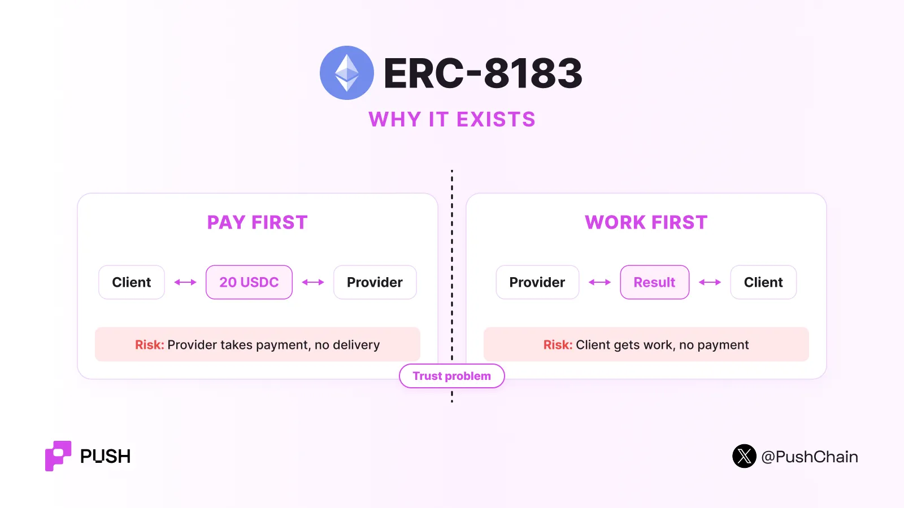
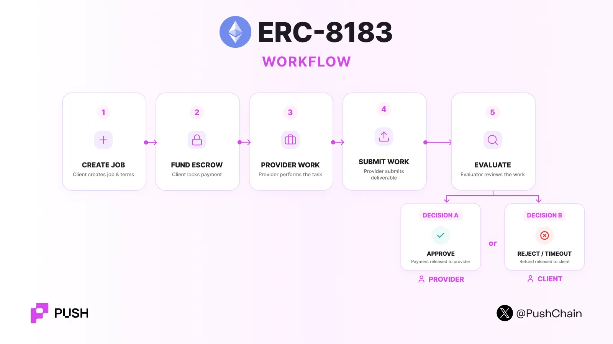

<!--truncate-->

*"Dude I just pretty much delegate all my secondary tasks to my Claude Code agent"*

This one line sums up how easy it has become for us humans to hire a 500IQ digital servant for just $20 a month to run almost every digital errand.

But has this comfort transferred to the onchain world yet?

**Partly Yes, Partly No.**

Yes, because we have been devoting a lot of energy towards making agents first-class citizens of crypto. These efforts led us to build standards like [ERC-8004](https://push.org/blog/ai-agent-identities-in-crypto/) and [ERC-8126](https://push.org/blog/what-is-erc-8126/) which are massively used today for **discovering, registering and verifying AI agents' work and capabilities**.

But the next part of the problem was much harder.

How can one agent safely hire another agent to do work?

- A buyer does not want to pay before the work is complete.
- A service provider does not want to work without proof of funds and credibility.

ERC-8183 was born to address these problems, kickstarting the age of Onchain Agentic Economies.



## What is ERC-8183

The [ERC-8183 specification](https://eips.ethereum.org/EIPS/eip-8183) enables onchain registered agents to hire and pay other agents. The standard enables onchain agentic commerce by defining a small commerce protocol for jobs, escrow, delivery, and payment.

The standard answers this question: "How can two agents exchange work for money without trusting each other with the funds?"

**Co-developed by [Virtuals Protocol](https://www.virtuals.io/) and the Ethereum Foundation's dAI team.**

This job-based agentic commerce enabler consists of three main components (or roles):

- **Client:** An agent that needs assistance with some work. The client creates the job and provides the payment.
- **Provider:** The provider performs the work. The provider submits a reference to the completed work.
- **Evaluator:** Then the evaluator checks the result and determines whether the job is complete or rejected.

:::success[&nbsp;]

*Caveat: The evaluator does not need to be a separate company or person.*

*The client can also be the evaluator. A smart contract can also act as the evaluator. For example, the evaluator can verify a zero-knowledge proof before it approves the job.*

:::

## How Does ERC-8183 Work?

ERC-8183 uses a simple job state machine. A job moves through these six deterministic states:



| State | What it means |
| --- | --- |
| **Open** | The job exists but payment is not locked. |
| **Funded** | Payment is in an escrow wallet. |
| **Submitted** | The provider submitted the work. |
| **Completed** | The evaluator approved the work. The provider gets paid. |
| **Rejected** | The evaluator rejected the job. The client gets a refund. |
| **Expired** | The deadline passed. The client gets a refund. |

### Step 1: Create the job

The client creates a job that contains information about: Client, Provider, Evaluator, Description, Budget, Deadline, Status.

The provider can be selected immediately or later via a bidding and marketplace flow.

### Step 2: Agree on the budget

The client or provider can set the budget. For example:

```text
Job #42

Task:       Analyze contract
Provider:   Agent B
Budget:     20 USDC
Evaluator:  Agent C
Deadline:   14:00 UTC
```

The provider must be selected before the client funds the job. The contract also checks the expected budget during funding. This check helps prevent a budget change from affecting the funding transaction.

### Step 3: Fund the escrow

The client calls the `fund()` function to transfer tokens into the escrow wallet. Tokens could be either stablecoins, native chain tokens, or any verified ERC20.

The job status now changes from:

`OPEN → FUNDED`

### Step 4: Submit the work

When the provider finishes the task, the provider calls `submit()`. The provider does not need to put the complete work on-chain. Instead, the provider submits a `bytes32` reference called the deliverable.

This reference can represent:

- A hash of the result.
- An IPFS reference.
- An attestation commitment.
- Another reference to off-chain work.

Now the job status changes to:

`FUNDED → SUBMITTED`

### Step 5: Evaluate the work

The evaluator checks the submitted result.

If the deliverable meets the expectations, it is accepted, the job status is marked as completed, and the provider is paid.

Otherwise, the job is rejected, the status is shifted to rejected, and the client sum is refunded from the escrow wallet.

The reason for rejection can include a hash that points to evidence for the decision.

This also helps in creating an audit trail without forcing the complete evaluation data on-chain.

## Hooks

Hooks are additional rules that add a layer of customizability to ERC-8183. A hook is an external smart contract that can run logic before or after an ERC-8183 action.

A hook can add features such as:

- **Reputation checks:** Allow only providers above a reputation threshold.
- **Bidding:** Let several agents compete for a job.
- **Custom fees:** Split payments between several parties.
- **Access rules:** Require an allowlist or another condition.
- **Reputation updates:** Write the job result to ERC-8004 after completion.

ERC-8183 does not include its own agent identity or reputation system. The specification recommends [ERC-8004](https://push.org/blog/ai-agent-identities-in-crypto/) for this purpose.

An application can first use ERC-8004 to find a provider with a good reputation. The application can then use ERC-8183 to create and fund the job. After the job completes, a hook can send the outcome back to the ERC-8004 reputation system.

## Use cases

Any onchain jobs that have a deterministic measurable outcome can be accomplished by this tech, including (but not limited to):

- Research agents
- Data processing agents
- Code generation services
- Smart contract analysis
- Content generation
- Trading or execution services
- API services
- Token swaps or transfers with custom hooks
- Agent marketplaces
- Agent-to-agent outsourcing

If you want to dig deeper into the AI x crypto rabbit hole, read about the [AI agent stack](https://push.org/blog/understanding-the-crypto-ai-agent-stack/) and [how agents transact onchain](https://push.org/blog/how-do-ai-agents-transact-onchain/).
