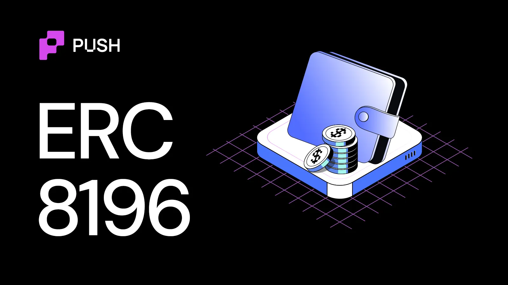
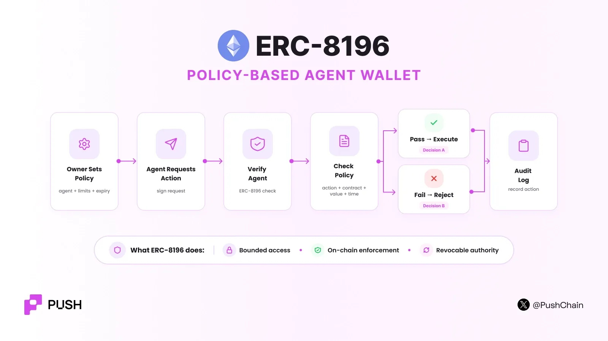

import BlogTweet from '@site/src/components/BlogTweet';



<!--truncate-->

Humanoids and robots are a hot trend these days. Imagine you're the proud owner of one of the finest bots, and one fine day you ask it to mow your lawn while you're out for some weekly grocery refill.

Alas! You come back to find out the robot not only trimmed the lawn but also axed your garden, bonsai plants and even your fence!


*Maybe the agent made a bad decision.*

*Maybe its host changed its instructions.*

*Maybe an attacker compromised it.*

*Maybe it hallucinated.*

*But the root cause was the same:*

The agent had more authority than it needed.

In the onchain world, ERC-8196 tries to solve this problem.

It lets a user give an AI agent limited and verifiable permission to use a wallet.

But it must act inside rules that the owner defines first.

*Just for context:*

*We're at a conjecture where there's a parabolic spike in usage and demand for crypto ai agents.*

<BlogTweet id="2089742044306837786" />

<BlogTweet id="2094802961977553117" />

## What is ERC-8196?

[ERC-8196](https://eips.ethereum.org/EIPS/eip-8196) defines a standard interface for an **AI Agent Authenticated Wallet**.

The wallet does not give the agent unrestricted control.

Instead, the asset owner creates a policy.

The policy defines:

- What the agent can do.
- Which contracts it can use.
- How much value it can move.
- When its permission starts.
- When its permission ends.
- What ERC-8126 risk level is acceptable.

The wallet checks this policy before it executes an agent action.

ERC-8196 therefore answers:

***"Is this agent allowed to perform this action right now?"***

This is different from agent identity, and it is also different from agent reputation.

ERC-8196 focuses on execution authority.

***Co-authored by Leigh Cronian from [@cybercentry](https://x.com/cybercentry) and [Don Johnson](https://x.com/DonJohnsonSays) from [@virtuals_io](https://x.com/virtuals_io)***

## Why does ERC-8196 exist?

Before we understand the working of this ERC, let's reason why it even exists in the first place.

Most wallets were designed for people.

A person owns a private key, manually signs transactions for the blockchain to execute and settle.

**Agents are probabilistic** in nature and can make hundreds of decisions without a person approving each one. This creates a delegation problem where you're left with a few options.

### **Option 1 - Give agent the private key**

EXTREMELY DANGEROUS!

If the agent host is compromised, the attacker can get full control of the wallet.

The ERC calls this the **hosting trust trap**.

### **Option 2: Ask the user to approve every action**

This is relatively safer. But a total UX nightmare. Plus, the agent is no longer autonomous.

You (the operator) will always have to be around and in the loop to approve the agent's txn requests.

### **Option 3: The middle path**

Give the agent policy-bound access privileges defined by the owner/operator beforehand.

## What does a policy contain?

**A policy in ERC-8196 defines the agent's operating boundary.**

The specification includes fields such as:

- *Agent:*
- *Owner:*
- *Allowed Actions:*
- *Allowed Contracts:*
- *Blocked Contracts:*
- *Max value/ transaction:*
- *Max value/day:*
- *Valid from:*
- *Valid until:*
- *Risk limit:*

The policy therefore converts a vague instruction such as: "Manage some of my funds" into machine readable deterministic rules.

## **HOW does ERC-8196 work?**



### **Step 1: The owner registers a policy**

The owner calls the `registerPolicy()` function.

The policy connects: Owner + Agent + Rules

The wallet creates a **policyHash**. This hash gives the policy a fixed cryptographic reference so that the agent cannot silently replace the policy with different rules.

### **Step 2: The agent requests an action**

Suppose the agent wants to make a swap. The request contains information such as:

- Agent
- Action
- Target contract
- Value
- Transaction data
- Nonce
- Expiry
- Policy hash

The agent signs the action.

ERC-8196 uses [EIP-712 typed signatures](https://eips.ethereum.org/EIPS/eip-712) for this structure. The signature ties the action to a specific policy.

**This is important:** The agent cannot take a signature created for Policy A and freely use it under Policy B.

### **Step 3: Check ERC-8126**

Before the action executes, the wallet must check the agent through [ERC-8126](https://push.org/blog/what-is-erc-8126/).

ERC-8126 produces a risk score between 0-100.

Lower is better. The ERC-8196 policy defines an acceptable limit. The specification requires the wallet to reject the action when the current ERC-8126 score is above the policy threshold.

| Standard | Question it answers |
| --- | --- |
| **ERC-8126** | "Should this agent be trusted?" |
| **ERC-8196** | "Can this agent do THIS action?" |

### **Step 4: Verify actions**

After verification, ERC-8196 checks the action against the set policy. A failure at any important check stops the transaction.

### **Step 5: Track the audit trail**

Autonomous agents can perform many actions. While users need to know what happened.

ERC-8196 therefore defines a **hash-chained audit trail**. Each audit record links to the previous record.

```text
ACTION 1
│
▼
HASH A
│
▼
ACTION 2
│
▼
HASH B
│
▼
ACTION 3
```

If someone changes an old record, the hash chain breaks making the tampering detectable.

### **Step 6: Entropy commitment**

AI agents are not always deterministic. The same prompt can sometimes produce different results.

A malicious host could exploit this. For example, the host can run the agent many times:

```text
Run 1 → Don't trade
Run 2 → Don't trade
Run 3 → Trade
Run 4 → Don't trade
```

The host can then select only the output that benefits it.

ERC-8196 includes an **entropy commitment** in agent actions to help reduce this type of manipulation. The standard describes a commit-reveal approach for probabilistic agent behaviour.

## **When should ERC-8196 be used?**

ERC-8196 is useful when an AI agent needs **real authority over assets or credentials**.

- **Trading agents -** An agent can swap tokens within a fixed daily limit.
- **Treasury agents -** An agent can move funds only between approved contracts.
- **DeFi agents -** An agent can rebalance positions but cannot transfer funds to arbitrary wallets.
- **Payment agents -** An agent can pay approved services below a transaction limit.

Read the official [ERC-8196 documentation here](https://eips.ethereum.org/EIPS/eip-8196).

If you want to dig deeper into the AI x crypto rabbit hole, get latest information about the [AI agent stack](https://push.org/blog/understanding-the-crypto-ai-agent-stack/), [how agents transact onchain](https://push.org/blog/how-do-ai-agents-transact-onchain/) and [ERC-8183](https://push.org/blog/complete-guide-to-erc-8183/).

Happy lawn moving!
