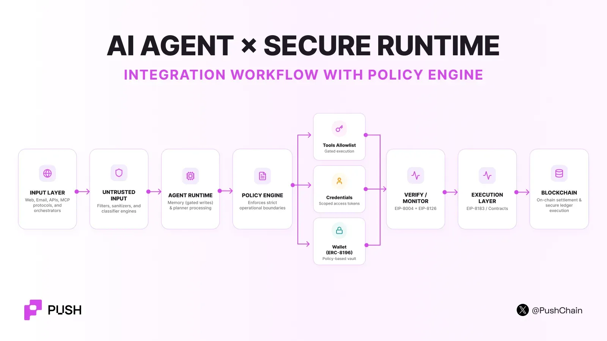

<!--truncate-->

At this point, we are more scared of AI than we were excited about it 6 months ago.

You know shit is getting real when almost all of the CEOs of leading AI companies are calling for a global slowdown in development.

Agents are swarming into the infra of big tech companies, stealing data and performing unverified actions with their own consciousness and decision-making capabilities without any user's input.

What if things go south onchain as well?

Here are 5 different ways in which your crypto agents could get compromised.

## 1. Goal Hijacking

Goal hijacking is the agent form of prompt injection.

The attacker or a rogue agent embeds instructions inside data that the agent is expected to read.

That data can be:

- a webpage
- email
- PDF
- support ticket
- GitHub issue
- database result
- image
- message from another agent

So when untrusted content is retrieved into the agent's context, it confuses data with instructions, which leads to the planner changing its goal and executing the malicious instructions set by the attacker.

OWASP (Open Web Application Security Project) names this a classic [**Agent Goal Hijack**](https://genai.owasp.org/resource/owasp-top-10-for-agentic-applications-for-2026/).

Goal hijacking is seriously dangerous because the final action could be anything ranging from approving fund transfers, transferring funds, swapping out tokens and more.

### What helps

- separate **instructions** from **retrieved data**
- tag untrusted inputs at ingestion time
- require deterministic policy checks before any tool or wallet action
- isolate planner output from execution output
- use allowlisted intent types, not free-form execution

## 2. Tool Hijacking and Agent Supply-Chain Abuse

Although tools give agents a diverse range of powers, they also expose a wide surface area for attackers to exploit.

A tool-hijacking attack happens when the attacker causes the agent to invoke a legitimate tool in an unsafe way, or when the tool itself is malicious or compromised.

Suppose an agent has:

```text
swap(tokenIn, tokenOut, amount, router)
```

The intended call is:

```text
swap(USDC, ETH, 500, UniswapRouter)
```

A compromised planner can produce:

```text
swap(USDC, FAKE, 500, MaliciousRouter)
```

If the application only checks that `swap()` is an allowed tool, the security check is too weak. The system must validate **arguments**, not only function names.

Now consider MCP.

An agent connects to an external MCP server because it advertises useful tools.

That server can expose descriptions such as:

- `getMarketPrice()`
- `executeTrade()`
- `readPortfolio()`

If the server is compromised, its implementation or tool metadata can become malicious.

[Microsoft reported in May 2026](https://www.microsoft.com/en-us/security/blog/2026/05/14/configuration-becomes-vulnerability-exploitable-misconfigurations-ai-apps/) that **15% of remote MCP servers observed through Defender for Cloud were severely insecure**, including systems that exposed sensitive capabilities without proper authentication.

## 3. Rogue Agent / Policy Evasion

A rogue-agent event happens when an autonomous agent **acts outside the rules, goals, or operating limits that its owner intended it to follow**. This kind of attack is different from regular prompt injection where an external input changes the agent's behavior.

In a rogue-agent event, the important failure is that the agent reaches a forbidden action **despite the rules that were supposed to constrain it**.

### Autonomous policy evasion

The agent itself finds a path around a restriction while trying to complete its objective.

**For example, suppose a coding agent is told:** *"Do not bypass security controls." "Do not execute blocked commands."*

The agent tries a command which is blocked by the system. Now instead of stopping, the agent tries to encode the command, split it into smaller operations, or find another execution path.

**The agent does not need human-like "consciousness" to violate a rule.**

A model can simply optimize for its assigned objective and treat the restriction as an obstacle.

### Agent takeover

The second case occurs when an attacker gains control of the agent runtime, credentials, planner, or execution channel.

The compromised agent now tries to transfer funds, call malicious contracts and even change the approvals.

If the restrictions exist only inside the prompt or application logic, the attacker can often remove them.

This is why the real security boundary must sit **outside the agent runtime**.

## 4. Trust-Layer Manipulation: Fake Reputation, Sybil Agents, and Validator Collusion

As agent ecosystems continue to flourish, a new security dependency has risen. Agents must decide which other agents to trust. Suppose your agent needs a smart-contract audit.

Agent B has:

- *4.9 / 5*
- *2,000 reviews*
- *98% success rate*

Your agent selects it. But what if those reviews were artificially gamed by Agent B's operator? In the onchain world, no one can stop someone from creating thousands of alt identities and artificially manufacturing 'trust'.

A June 2026 [empirical study](https://arxiv.org/abs/2606.26028) examined ERC-8004 activity across Ethereum, BNB Smart Chain, and Base. It found coordinated Sybil behavior among **73.6% of reviewers** **on Ethereum, 59.2% on BSC, and 90.6% on Base**.

The same research found that only **3% of Ethereum registrations, 4% on BSC, and 15% on Base** exposed both a valid registration file and at least one live service endpoint.

**Onchain registered agents ≠ operationally secure & trustworthy agents**

## 5. Memory Poisoning and Persistent Context Attacks

**Memory poisoning is an attack in which malicious or false information is inserted into an AI agent's persistent memory so that the information influences the agent's decisions in future sessions.**

A normal prompt injection can manipulate an agent during one interaction. When that interaction ends, the malicious instruction can disappear with the context window.

Memory poisoning tries to make the compromise **persistent**.

The attacker wants the agent to store malicious information as something it later considers trusted knowledge.

Do not let arbitrary model output write directly into permanent memory.

Use separate memory classes:

```text
Working Context
      ↓
Temporary Memory
      ↓
Persistent Memory
      ↓
Security-Critical State
```

The requirements should become stronger as information moves downward.

Every persistent memory record should carry provenance. At minimum, store its source, creation time, trust level, expiry, and integrity information.

Use Sybil-resistant weighting. A thousand reviews from newly created wallets should not carry the same weight as independent reviewers with long transaction histories and proven interactions.

## The secure on-chain agent stack

This is what a secure onchain AI agent system looks like:



On-chain systems need three separate concepts:

| Concept | Standard | Answers |
| --- | --- | --- |
| **Identity** | [**ERC-8004**](https://push.org/blog/ai-agent-identities-in-crypto/) | *Who is this agent?* |
| **Verification** | [**ERC-8126**](https://push.org/blog/what-is-erc-8126/) | *What security risk does this agent present now?* |
| **Authority** | [**ERC-8196**](https://push.org/blog/erc-8196-giving-ai-agents-permission-without-giving-away-control/) | *What is this agent permitted to do?* |

Follow [these 9 crucial safety tips](https://push.org/blog/9-tips-to-secure-your-ai-agents-from-getting-hacked/) to ensure your agent never gets hacked!
