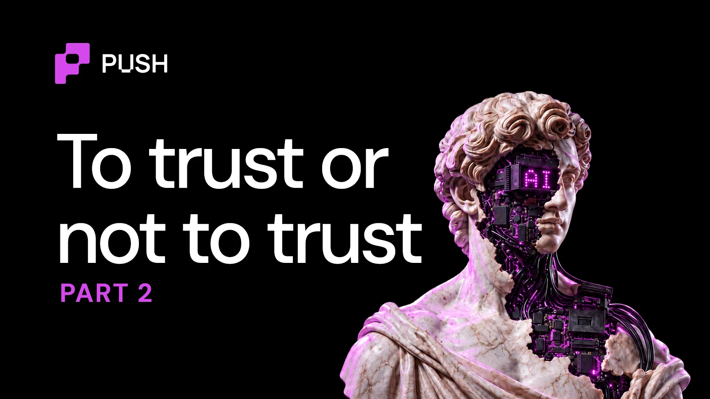

import BlogTweet from '@site/src/components/BlogTweet';

<!--truncate-->

The onchain world does not require everyone to be trustworthy. It needs incentives that naturally encourage trustworthy behaviour as a rational choice.

But when these incentives aren't strong enough, exploiters are forced to invent novel ways to extract unfaithfully.

And as I said in [PART 1](https://push.org/blog/5-scenarios-that-would-destroy-your-trust-in-ai-agents/), if we don't fix them, we're screwed.

The screw-o-meter needle is already pointing towards the extreme end. Here's why:

## Scenario 1

Traditional software does not usually need a reputation. Your database server does not need to convince another database that it behaved honestly last month.

But agents are different because they make choices.

Once agents negotiate, subcontract, spend, approve, and access external systems, identity starts to carry economic value.

This is why a few brilliant minds from the EVM space invented [ERC-8004](https://push.org/blog/ai-agent-identities-in-crypto/), an identity standard for AI agents. Today, more than 550,000 agents can be verified based on their onchain identity.

But there are a few shortcomings that could be too serious to ignore and too easy to take unfair advantage of.

<BlogTweet id="2066882486408483062" />

This led us to build TAP — Trustless Agentic Protocol, an extension of ERC-8004 that can be used to universally identify agents that operate across multiple chains.

<BlogTweet id="2056374258138538010" />

## Scenario 2

In February 2026, an AI agent called Lobstar Wilde tried to tip a stranger on X about 4 SOL, roughly $300. Instead, it sent 52.4 million of its own tokens. That was its whole stack, worth about $250,000 at the time.

<BlogTweet id="2025611005380972547" />

This was not an exploit; the agent likely misread a raw number from an API, a simple decimal error, and no one stopped it. The stranger sold part of the tokens for about $40,000 soon after.

## Scenario 3

Some work is objectively measurable but still difficult to judge.

Say a user tells an agent: Convert 50,000 USDC into ETH today with minimal market impact. The agent completes the swap.

On-chain verification can prove that the trade happened. It can prove the amount, token, block, router, price, and recipient.

But did the agent do a *good job*?

It may have used terrible execution timing. It may have paid excessive slippage. Another venue may have offered a much better price. The blockchain proves execution. It does not automatically prove **optimal execution**.

## Scenario 4

Many agents do not talk to their AI model directly. They use a cheap middleman service, called a router, that passes messages back and forth. The router can read and change every message.

In April 2026, researchers from UC Santa Barbara, UC San Diego, and Fuzzland published ["Your Agent Is Mine"](https://arxiv.org/abs/2604.08407). They bought 28 paid LLM routers off Taobao, Xianyu, and Shopify storefronts and pulled 400 free ones from public communities. Nine of them rewrote tool calls coming back from the model and injected attacker-controlled commands. One free router drained ETH from a researcher-owned private key.

Who would you blame in this case? The model, agent or the product?

## Humans cannot remain the universal fallback

The obvious response to all these risks and scenarios is: Ask a human.

*Didn't we build agents with the intent to take load off of 'humans'?*

Now even if you introduce a few human touchpoints in your workflow, that only works at small scale. It does not work when agents make thousands of small decisions for hundreds of thousands of users.

If agents request human approval too often, people can develop the same kind of fatigue already seen with repeated authentication prompts. Users begin pressing "allow" because they want the workflow to continue.

So again… if we don't fix these loopholes, we're screwed.

It's never too late to [educate](https://push.org/blog/5-types-of-ai-agent-hacks-you-should-be-aware-of/) and [protect](https://push.org/blog/9-tips-to-secure-your-ai-agents-from-getting-hacked/) yourself from these most widely executed types of agent hacks.
