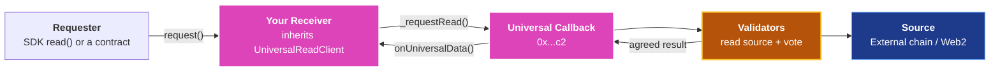

<head>
  <title>Contract-Initiated Universal Read and Callback | Build | Push Chain Docs</title>
</head>

import Details from '@theme/Details';
import PushAPIReference from '@site/src/components/PushAPIReference/PushAPIReference';

{/* Content Start */}

## Overview

Contract-Initiated Universal Read and Callback lets **your own Push Chain contract receive the result of a universal read and act on it**. Validators read state from an external chain or a Web2 endpoint, agree on the bytes, and Universal Callback delivers them into a function on your contract.

The read is paid and asynchronous. Your contract funds it at request time, the result arrives in a later block, and the callback runs inside a gas bound you choose, up to 1,000,000 gas.

If only your app or backend needs the value, you do not need a contract. Omit `callback` and the Universal Read Registry stores the result for you. See [Read Universal State](/docs/chain/build/universal-read/).

> **Note**: The base contract's full surface, with read-only playgrounds against the deployed registry, is in [Contract Helpers](/docs/chain/build/contract-helpers/#universal-read-client).

## How This Differs from Universal Read

Universal Read is consumed by an app through the SDK. Contract-initiated read and callback is consumed by a Push Chain contract. Both use the same validators and the same Universal Callback, but the result lands in a different place.

| Dimension | Universal Read | Contract-Initiated Universal Read and Callback |
|-----------|----------------|-----------------------------------------------|
| **Who receives the result** | The Universal Read Registry. | Your contract, in `_onReadResult`. |
| **Where the result lives** | Registry storage, exposed by the SDK as `value`. | Your storage, in whatever shape you write. |
| **Who requests** | The SDK, through `read`. | The SDK through `read` with `callback`, or your contract on its own. |
| **Who pays** | The requesting wallet. | `msg.value` on your request entrypoint. The SDK quotes it; a contract sends it. |
| **Refunds** | Back to the requesting account. | To `revertRecipient`, which defaults to your contract. |
| **SDK involvement** | Required. | Optional. A contract can build the request itself. |

The key distinction is that the result becomes **contract state in the same transaction that delivers it**. Settling a position, unlocking a pending action, gating a payout on external state, all of it runs inside your callback without an off-chain relayer.

## Key Concepts

### Universal Callback

Universal Callback is the predeploy on Push Chain that accepts read requests, holds the callback budget, delivers results and settles refunds. It is deployed at [0x00000000000000000000000000000000000000c2](/docs/chain/setup/smart-contract-address-book/#push-chain-core-functionalities) on Push Chain Donut Testnet, listed as Universal Read / Callback in the address book.

Key properties:
- **Single entry**: `requestExternalReadSelf(spec, callbackSelector, callbackGasLimit)` is the only way in. `UniversalReadClient` calls it for you.
- **Single delivery**: only Universal Callback may call your contract with a result. The base contract enforces this.
- **Gas bound**: `callbackGasLimit` caps what your callback may consume. The hard cap is 1,000,000 gas; the registry uses 500,000.
- **Lifecycle**: a request moves through `PENDING`, `EXECUTED` (callback ran) and `SETTLED` (gas reported, refund sent), or `EXPIRED`. `statusOf(requestId)` returns the current state; an unknown ID reads as `NONE`.

### UniversalReadClient

`UniversalReadClient` is the abstract base contract you inherit. It stores the Universal Callback address, submits requests with `_requestRead`, receives deliveries in `onUniversalData`, and hands them to the `_onReadResult` you implement.



Key properties:
- **You write two functions**: a payable request entrypoint that calls `_requestRead`, and `_onReadResult`, which receives the bytes.
- **Local state travels with the request**: the `localState` bytes you pass to `_requestRead` come back with the result, so your callback knows what it asked for.
- **Refunds default to the contract**: `_requestRead` sets `revertRecipient` to your contract when you leave it empty, so your contract needs a payable `receive()` or the refund is not delivered.

### ReadSpec

`ReadSpec` is the request struct Universal Callback validates and validators execute. The SDK builds it in `prepareRead`; a contract can build it by hand.

```solidity
struct ReadSpec {
    UniversalAccountId account;      // { chainNamespace, chainId, owner }: where to read
    bytes   query;                   // Encoded query envelope for that chain family
    uint16  minConfirmations;        // At least 1
    uint64  blockNumber;             // Pinned source block, at most the oracle height
    uint64  expiryPushChainHeight;   // Push Chain block after which the request expires
    uint256 maxFee;                  // Upper bound on msg.value the request accepts
    address revertRecipient;         // Receives the unused callback budget
}
```

<PushAPIReference showRequiredNotice={false}>

| Field | Type | Description |
| ----- | ---- | ----------- |
| `account.chainNamespace` | `string` | Bare namespace: `eip155`, `solana` or `web2`. |
| `account.chainId` | `string` | Chain ID within the namespace, for example `11155111` for Ethereum Sepolia. |
| `account.owner` | `bytes` | The account being read on Solana (32 bytes). For EVM reads validators do not use it; any non-empty bytes are accepted. |
| `query` | `bytes` | The chain family's query envelope. For EVM: `abi.encode` of `(uint8 queryType, (uint8 refType, uint64 blockNumber) blockRef, bytes payload)`. |
| `minConfirmations` | `uint16` | Confirmations the source block must have before validators read it. Minimum `1`. |
| `blockNumber` | `uint64` | Source block to read at. Must be non-zero and at most the height Universal Core has observed for that chain. `0` for Web2. |
| `expiryPushChainHeight` | `uint64` | Must be greater than the current Push Chain block. The SDK uses the current block plus 300. |
| `maxFee` | `uint256` | The request reverts when `msg.value` exceeds it. Set it to `msg.value` when you have no separate cap. |
| `revertRecipient` | `address` | Receives the unused callback budget on settlement and the full budget on expiry. Must accept native transfers. |

</PushAPIReference>

### Mental Model

1. Your contract asks Universal Callback for a read and pays up front.
2. Validators fetch and agree; Universal Callback calls your contract with the bytes.
3. Your contract decodes the bytes and updates its own state.

## Deploy a Receiver

The receiver is your contract. It exposes one payable request entrypoint and overrides `_onReadResult`. The example below stores raw result bytes per request and accepts requests from one account.

```solidity
// SPDX-License-Identifier: MIT
pragma solidity 0.8.26;

import {UniversalReadClient} from "push-chain-core-contracts/src/UniversalReadClient.sol";
import {ReadSpec} from "push-chain-core-contracts/src/libraries/ReadTypes.sol";

/**
 * @title ExternalStateInbox
 * @notice Requests universal reads and stores each delivered result by request ID.
 */
contract ExternalStateInbox is UniversalReadClient {
    /// @notice The only Push Chain account allowed to submit requests
    address public immutable REQUESTER;

    /// @notice Raw result bytes, keyed by the numeric request ID
    mapping(uint256 => bytes) public results;

    /**
     * @param callbackAddress The Universal Callback contract that delivers results
     * @param requester_ The Push Chain account that will submit requests
     */
    constructor(address callbackAddress, address requester_)
        UniversalReadClient(callbackAddress)
    {
        require(requester_ != address(0), "zero requester");
        REQUESTER = requester_;
    }

    /**
     * @notice Payable request entrypoint the SDK calls
     * @param spec The prepared read, supplied by the SDK
     * @param gasLimit Gas reserved for _onReadResult
     * @return The numeric request ID
     */
    function request(ReadSpec calldata spec, uint64 gasLimit)
        external payable returns (uint256)
    {
        require(msg.sender == REQUESTER, "only requester");
        return _requestRead(spec, abi.encode(msg.sender), gasLimit);
    }

    /**
     * @dev Called by the base contract when Universal Callback delivers a result.
     *      Empty resultData means the source returned an error.
     */
    function _onReadResult(uint256 requestId, bytes calldata resultData, bytes memory)
        internal override
    {
        if (resultData.length == 0) return;
        results[requestId] = resultData;
    }

    /// @dev Receives the unused callback budget
    receive() external payable {}
}
```

Constructor arguments on Donut:

| Argument | Value |
| -------- | ----- |
| `callbackAddress` | `0x00000000000000000000000000000000000000c2`, the [Universal Read / Callback](/docs/chain/setup/smart-contract-address-book/#push-chain-core-functionalities) contract. |
| `requester_` | The address that will submit requests. For an SDK caller, `pushChainClient.universal.account`. |

:::warning Be careful which address you authorize
<br />`requester_` must match the **msg.sender** your receiver sees when a read is requested. For a caller using the SDK that is `pushChainClient.universal.account` on the client that will call `read`, which is not always the wallet that deployed the contract.
:::

## Request a Read

You can request a read in two ways: through the SDK, which builds the request and pays for it from the calling wallet, or from within your contract, which builds the request itself.

### Through the SDK

Point `read` at your receiver by passing `callback`. The SDK prepares the read, calls your payable entrypoint with the prepared `ReadSpec` and the callback gas, and waits for the result. The `callback` fields are documented in [Callback Arguments](/docs/chain/build/universal-read/#callback-arguments).

```typescript
const result = await pushChainClient.universal.read(holder, {
  chain: PushChain.CONSTANTS.CHAIN.ETHEREUM_SEPOLIA,
  callback: {
    target: receiverAddress,
    gasLimit: 200_000n,       // gas for _onReadResult, up to 1_000_000n
    abi: receiverAbi,
    functionName: 'request',  // your payable request entrypoint
  },
});

console.log(result.callbackDelivered); // true once _onReadResult ran
```

### From Within Your Contract

A contract that requests on its own builds the `ReadSpec` itself. The example below reads the Ethereum Sepolia ETH balance of an address and stores it by holder. It is the on-chain equivalent of the native balance read on [Read Universal State](/docs/chain/build/universal-read/#evm-reads).

```solidity
// SPDX-License-Identifier: MIT
pragma solidity 0.8.26;

import {UniversalReadClient} from "push-chain-core-contracts/src/UniversalReadClient.sol";
import {ReadSpec} from "push-chain-core-contracts/src/libraries/ReadTypes.sol";
import {UniversalAccountId} from "push-chain-core-contracts/src/libraries/Types.sol";

interface IUniversalCore {
    function chainHeightByChainNamespace(string calldata caip2) external view returns (uint256);
}

/**
 * @title BalanceWatcher
 * @notice Requests the Ethereum Sepolia ETH balance of an address with no SDK in the loop.
 */
contract BalanceWatcher is UniversalReadClient {
    /// @dev EVM query envelope. abi.encode of this struct is what validators decode.
    struct BlockRef { uint8 refType; uint64 blockNumber; }
    struct EvmQuery { uint8 queryType; BlockRef blockRef; bytes payload; }

    address public constant UNIVERSAL_CORE = 0x00000000000000000000000000000000000000C0;
    uint8 public constant QUERY_ACCOUNT_BALANCE = 0;

    /// @notice Latest delivered balance per holder, in wei
    mapping(address => uint256) public balances;

    constructor(address callbackAddress) UniversalReadClient(callbackAddress) {}

    /**
     * @notice Request the Sepolia ETH balance of `holder`
     * @dev msg.value must cover the protocol fee quoted by Universal Callback's estimateFee
     *      plus a callback budget of at least callbackGasLimit * block.basefee (with headroom);
     *      below that the request is never fulfilled and expires. Unused budget comes back.
     */
    function requestBalance(address holder) external payable returns (uint256) {
        uint64 height = uint64(IUniversalCore(UNIVERSAL_CORE).chainHeightByChainNamespace("eip155:11155111"));

        bytes memory query = abi.encode(EvmQuery({
            queryType: QUERY_ACCOUNT_BALANCE,
            blockRef: BlockRef({ refType: 0, blockNumber: height }),
            payload: abi.encode(holder)
        }));

        ReadSpec memory spec = ReadSpec({
            account: UniversalAccountId({ chainNamespace: "eip155", chainId: "11155111", owner: abi.encodePacked(holder) }),
            query: query,
            minConfirmations: 1,
            blockNumber: height,
            expiryPushChainHeight: uint64(block.number + 300),
            maxFee: msg.value,
            revertRecipient: address(this)
        });

        return _requestRead(spec, abi.encode(holder), 200_000);
    }

    /// @dev Empty resultData means the source returned an error; nothing is stored.
    function _onReadResult(uint256, bytes calldata resultData, bytes memory localState)
        internal override
    {
        if (resultData.length == 0) return;
        address holder = abi.decode(localState, (address));
        balances[holder] = abi.decode(resultData, (uint256));
    }

    /// @dev Receives the unused callback budget
    receive() external payable {}
}
```

The query envelope is rigid. Validators decode `query` as one ABI-encoded tuple, so build it with `abi.encode` of a struct as above, never as three separate parameters. The EVM payloads are:

| Query | `queryType` | `payload` | `resultData` |
|-------|-------------|-----------|--------------|
| Native balance | `0` | `abi.encode(address holder)` | `abi.encode(uint256)` |
| Contract call | `1` | `abi.encode(address target, bytes callData)` | Raw return bytes of the call |
| Storage slot | `2` | `abi.encode(address target, bytes32 slot)` | The 32-byte word |

> **Note**: Solana and Web2 envelopes carry more fields. Build those with the SDK's `prepareRead` and pass `prepared.specTuple` to your entrypoint, as described in [Read Multiple Universal States](/docs/chain/build/read-multiple-universal-states/).

## Read the Result On-Chain

`_onReadResult` receives the validator-agreed `resultData` and the `localState` you passed to `_requestRead`. Decode both with `abi.decode` into the types your read returns.

```solidity
uint256 balance = abi.decode(resultData, (uint256));   // balance, token balance, lamports
address holder = abi.decode(localState, (address));    // whatever you stored at request time
```

Empty `resultData` means the source returned an error: the target had no code at that block, the call reverted, or the endpoint failed. Return early rather than decoding, as both examples do. An expired request never reaches your callback at all.

## Verify From Off-Chain

To confirm your contract received the result, track the read and then read your contract's storage with a normal view call.

```typescript
const done = await pushChainClient.universal.trackRead({ requestId: result.requestId }).then((read) => read.wait());
if (done.callbackDelivered !== true) throw new Error('Receiver did not run');

const inbox = new ethers.Contract(receiverAddress, receiverAbi, provider);
const stored = await inbox.results(result.requestIdUint);
```

`callbackDelivered` is `false` when `_onReadResult` reverted or ran out of gas. `results` is keyed by the numeric request ID, which the SDK exposes as `requestIdUint` next to the hex `requestId`. See [Track Universal Read](/docs/chain/build/track-universal-read/) for resuming by request ID or transaction hash.

## Fees and Refunds

| Item | What happens |
|------|--------------|
| **Protocol fee** | Quoted by `estimateFee(chainNamespace, chainId)` on Universal Callback. Taken from `msg.value` at request time and not refunded. |
| **Callback budget** | Everything in `msg.value` above the protocol fee. After the callback runs, the gas it consumed is burned from the budget and the rest is sent to `revertRecipient`. |
| **Expiry** | A request that is not executed by `expiryPushChainHeight` expires and the full callback budget is refunded. The protocol fee is not. |
| **Refund delivery** | Refunds are pushed to `revertRecipient`. A contract without a payable `receive()` rejects the push and the refund is not delivered. |

The SDK quotes all of this as `prepared.fees` and `prepared.value`. A contract that requests on its own must send at least `estimateFee(chainNamespace, chainId) + callbackGasLimit × block.basefee`, with headroom because the base fee can rise before fulfilment. `estimateFee` returns 0 on Donut today, so the callback budget is the whole requirement; a request below it is never fulfilled and expires.

## Security Considerations

- **Only Universal Callback can deliver**<br />
  `onUniversalData` on the base contract rejects every caller except Universal Callback. Do not override it; put your logic in `_onReadResult`.

- **Gate the request entrypoint**<br />
  A payable entrypoint that anyone can call lets anyone write into your request bookkeeping. Restrict it to the accounts you expect, as `REQUESTER` does, or make the entrypoint deliberately public and treat each result as untrusted input.

- **The result is only as good as the request**<br />
  Callback arrival proves validators agreed on the bytes for the spec that was submitted, not that the spec was the one you wanted. When the SDK builds the spec, record what you expect (a query key or a target address) in `localState` and check it in the callback before acting.

- **Empty bytes are an error, not a zero**<br />
  Decoding empty `resultData` as `uint256` reverts, which burns your callback budget and marks the callback as failed. Check the length first.

- **No reads from inside a callback**<br />
  Starting a new `_requestRead` inside `_onReadResult` is not supported. Record what you need and start follow-up reads in a separate transaction.

## Limitations

| Area | Constraint |
|------|------------|
| **No synchronous result** | The request and the delivery are separate transactions. There is no in-call return value. |
| **Callback gas** | At most 1,000,000 gas per callback. Larger work must be split across transactions. |
| **One request per prepared read** | On the SDK path the entrypoint must call `_requestRead` exactly once per prepared read. |
| **Query envelopes** | EVM envelopes are simple enough to build in Solidity. Solana and Web2 envelopes should come from the SDK. |
| **Supported sources** | Ethereum Sepolia, Arbitrum Sepolia, Base Sepolia, BNB Testnet, Solana Devnet and HTTPS endpoints on Donut. |

## Troubleshooting

| Symptom | Likely cause | Fix |
|---|---|---|
| `callbackDelivered` is `false` | `_onReadResult` reverted or ran out of gas | Raise `gasLimit`, up to `1_000_000n`, and make sure the callback cannot revert on empty `resultData`. |
| Entrypoint reverts with `only requester` | The caller is not the account you authorized | Pass `pushChainClient.universal.account` as `requester_`, not the deploying EOA. See [Deploy a Receiver](#deploy-a-receiver). |
| Request reverts with `InvalidBlockNumber` | `blockNumber` is `0` or above the height Universal Core has observed | Read `chainHeightByChainNamespace` with the full CAIP-2 key, for example `eip155:11155111`, and pin at or below it. |
| Request reverts with `InvalidExpiryHeight` | `expiryPushChainHeight` is not above the current block | Use `block.number + 300` or another future height. |
| Request reverts with `InsufficientFee` or `ExcessiveFee` | `msg.value` is below `estimateFee` or above `spec.maxFee` | Quote `estimateFee` before sending and set `maxFee` to `msg.value` when you have no separate cap. |
| SDK rejects the transaction over `ReadRequested` | Your entrypoint called `_requestRead` more or fewer than once | Keep one `_requestRead` per prepared read. |
| Refund never arrives | `revertRecipient` is a contract without a payable `receive()` | Add `receive() external payable {}` or point `revertRecipient` at an EOA. |
| Callback ran but stored nothing | The source returned an error and `resultData` was empty | Check the target, ABI and pinned block. The SDK shows the reason as `raw.errorCode`. |

## When to Use This

Use this pattern when:

- A Push Chain contract must react to state on another chain or a Web2 endpoint: settle, unlock, pay out, rebalance.
- The read is part of automation with no user online: keepers, governance outcomes, scheduled checks.
- You want the verdict and the action in one place, with no off-chain relayer between them.

Do not use it when:

- Only your app or backend needs the value. Omit `callback` and read `value` from the SDK.
- The result must be available in the same transaction. Reads are asynchronous.

## Next Steps

- Learn the query grammar and read types in [Read Universal State](/docs/chain/build/universal-read/)
- Batch several reads through your receiver with [Read Multiple Universal States](/docs/chain/build/read-multiple-universal-states/)
- Resume a read from a saved request ID or transaction hash with [Track Universal Read](/docs/chain/build/track-universal-read/)
- Explore the `UniversalReadClient` base contract in [Contract Helpers](/docs/chain/build/contract-helpers/#universal-read-client)
